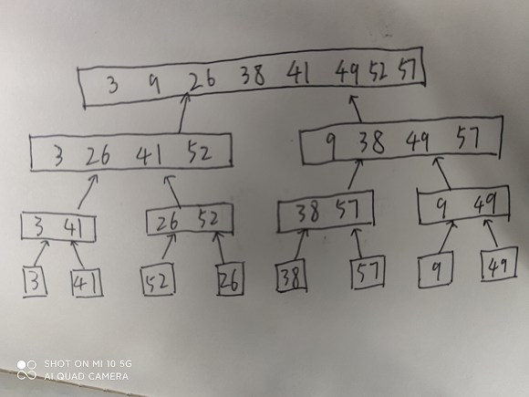
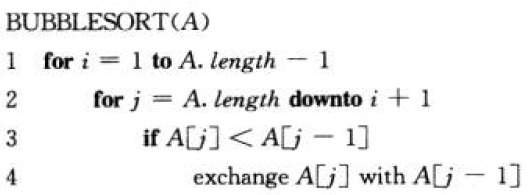
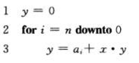

# 算法基础

## 2.1-1

Q：以图2-2为模型，说明INSERTION-SORT在数组 A = <31, 41, 59, 26, 41, 58> 上的执行过程。

A：

```text
[31, 41(sorted),|j=2| 59, 26, 41, 58]
[31, 41, 59(sorted),|j=3| 26, 41, 58]
[26(sorted), 31, 41, 59,|j=4| 41, 58]
[26, 31, 41, 41(sorted), 59,|j=5| 58]
[26, 31, 41, 41, 58(sorted), 59|j=6|]
```

[A1_1.py](./Resources/A1_1.py)

------------------------------------

## 2.1-2

Q：重写过程INSERTION-SORT，使之按非升序（而不是非降序）排序。

A：

[A1_2.py](./Resources/A1_2.py)

------------------------------------

## 2.1-3

Q：考虑以下**查找问题**：

输入：$n$个数的一个序列 $A = <a_1, a_2, ..., a_n>$ 和一个值$v$。

输出：下标$i$使得$v = A[i]$或者当$v$不在$A$中出现时，$v$为特殊值NIL。

写出**线性查找**的伪代码，它扫描整个序列来查找$v$。使用一个循环不变式来证明你的算法是正确的。确保你的循环不变式满足三条必要的性质。

A：

```code
LINER-FIND(A,v):
    for i = 1 to A.length
        if A[i] == v
            return i
    return NIL
```

循环不变式：所有下标小于$i$当前值的数都不是所求的下标值。

初始化：该情况下$i=1$,下标最小，所以情况为真。

保持：对于某次迭代，下标值为$i$。小于$i$的下标对应数组中的值与$v$都不相等，且if语句判断当前下标对应数组中的值$A[i]$与$v$的相等性。如果相等则程序返回下标值$i$，即所求的值，否则迭代继续执行。此时下标值比上次迭代下标值大1，且所有小于该下标值的数组中值都不等于$v$。

终止：当下标值大于数组长度时终止，此时所有小于该下标值的数组中的值都不等于$v$，按要求返回NIL。

------------------------------------

## 2.1-4

Q：考虑把两个$n$位二进制整数加起来的问题，这两个整数分别存储在两个$n$元数组$A$和$B$中。这两个整数的和应按二进制形式存储在一个$(n+1)$元数组$C$中。请给出该问题的形式化描述，并写出伪代码。

A：

输入：两个代表$n$位二进制数的序列$A$和$B$，其中$A=<a_1,a_2,…,a_n>$，$B=<b_1,b_2,…,b_n>$。

输出：一个代表n+1位二进制数的序列$C$，其中$C=<c_1,c_2,…,c_n,c_{n+1}>$。

```code
ADD(A,B):
    inc = false
    for i = 1 to A.length
        if inc
            c = A[i] + B[i] + 1
        else
            c = A[i] + B[i]
        C[i] = c % 2
        inc = c > 1
    if inc
        C[i + 1] = 1
    else
        C[i + 1] = 0
```

------------------------------------

## 2.2-1

Q：用$\Theta$记号表示函数$n^3/1000 - 100n^2 - 100n + 3$。

A：$\Theta({n^3})$

------------------------------------

## 2.2-2

Q：考虑排序存储在数组$A$中的$n$个数：首先找出$A$中的最小元素并将其与$A[1]$中的元素进行交换。接着，找出$A$中的次最小元素并将其与$A[2]$中的元素进行交换。对$A$中前$n-1$个元素按该方式继续。该算法称为**选择算法**，写出其伪代码。该算法维持的循环不变式是什么？为什么它只需要对前$n-1$个元素，而不是对所有$n$个元素运行？用$\Theta$记号给出选择排序的最好情况与最坏情况运行时间。

A：

```code
SELECTION-SORT(A):
    for i = 1 to A.length-1
        k = FIND-MINIMAL(A, i)
        A[i], A[k] = A[k], A[i]

FIND-MINIMAL(A,b):
    minimal = A[b]
    index = b
    for i = b + 1 to A.length
        if A[i] < minimal
            minimal = A[i]
            index = i
    return index
```

循环不变式：每次循环结束后将序列中第i小的元素放置在序列的第i个位置上。

根据循环不变式，第n-1次循环将前n-1小的元素按序放置在前n-1个位置上，于是自然有第n个位置放置的是第n小（即最大）的元素。

最好与最坏情况运行时间都是：$\Theta({n^2})$。

------------------------------------

## 2.2-3

Q：再次考虑线性查找问题（参见练习2.1-3）。假定要查找的元素等可能地为数组中的任意元素，平均需要检查输入序列的多少元素？最坏情况又如何呢？用$\Theta$记号给出线性查找的平均情况和最坏情况运行时间。证明你的答案。

A：

平均情况下假设有$n$次查找，要查找的元素分别在数组中1到$n$的位置，平均每次执行次数为$(1 + 2 + ... + n)/n = (1 + n)n / 2n = (1 + n) / 2$，运行时间为$\Theta(n)$。

最坏情况下要查找的元素在数组末尾，需要执行完整个循环才能找到，执行次数为$n$，运行时间为$\Theta(n)$。

------------------------------------

## 2.2-4

Q：我们可以如何修改几乎任意算法来使之具有良好的最好情况运行时间？

A：预先存储该算法在最好情况下的运算结果，或者针对最好情况单独提供一套算法。

------------------------------------

## 2.3-1

Q：使用图2-4作为模型，说明归并排序在数组 A = <3, 41, 52, 26, 38, 57, 9, 49>上的操作。

A：



------------------------------------

## 2.3-2

Q：重写过程MERGE，使之不使用哨兵，而是一旦数值$L$或$R$的所有元素均被复制回$A$就立刻停止，然后把另一个数值的剩余部分复制回$A$。

A：


------------------------------------

## 2.3-3

Q：使用数学归纳法证明：当$n$刚好是2的幂时，以下递归式的解是$T(n)=n\lg n$

$$
T(n)=\begin{cases}
    2 & 若n=2\\
    2T(n/2) + n & 若n=2^k,k>1
\end{cases}
$$

A：

基本情况：当$n$是2的1次幂即$n=2$时，递归式$T(n)$值为2，将$n=2$代入$n\lg n = 2$，则基本情况下递归式$T(n)$的解为$n\lg n$。

假设，当$n$是2的$k$次幂时，递归式$T(n)$的解为$n\lg{n}$。

需证明：当$n = 2^{k+1}$时，递归式$T(n)$的解为$n\lg n$。

$T(2^{k+1}) = 2T(2^{k+1}/2) + 2^{k+1}$

$=2T(2^k)+2^{k+1}$

$=2\times2^k\lg 2^k + 2^{k+1}$

$=2^{k+1}\times k + 2^{k+1}$

$=2^{k+1}\times ({k+1})$

$=2^{k+1}\lg 2^{k+1}$

------------------------------------

## 2.3-4

Q：我们可以把插入排序表示为如下的一个递归过程。为了排序$A[1..n]$，我们递归地排序$A[1..n-1]$，然后把$A[n]$插入已排序的数值$A[1..n-1]$。为插入排序的这个递归版本的最坏情况运行时间写一个递归式。

A：

$$
T(n) = \begin{cases}
   \Theta(1) &\text{若 } n = 1 \\
   T(n - 1) + \Theta(n) &\text{若 } n > 1
\end{cases}
$$

------------------------------------

## 2.3-5

Q：回顾查找问题（参见练习2.1-3），注意到，如果序列$A$已排好序，就可以将该序列的中点与$v$进行比较。根据比较的结果，原序列中有一半就可以不用再做进一步的考虑了。**二分查找**算法重复这个过程，每次都将序列剩余部分的规模减半。为二分查找写出迭代或递归的伪代码。证明：二分查找的最坏情况运行时间为$\Theta(\lg n)$

A：

```code
BINARY-SEARCH(A,v):
    low = 1
    high = A.length
    while low <= high
        mid = (low + high) // 2 \\ 整除
        if A[mid] == v
            return mid
        elseif A[mid] < v
            low = mid + 1
        else
            high = mid - 1
    return NIL
```

每一次while循环将待比较的元素范围$n$缩减了一半，因此while循环执行的总次数为$\lg n$，算法的最坏情况运行时间为$\Theta{(\lg n)}$

------------------------------------

## 2.3-6

Q：注意到2.1节中的过程INSERTION-SORT的第5~7行的while循环采用一种线性查找来（反向）扫描已排好序的子数组$A[1..j-1]$。我们可以使用二分查找（参见练习2.3-5）来把插入排序的最坏情况总运行时间改进到$\Theta(n\lg n)$吗？

A：不可行。插入排序在扫描已排好序的子数组的同时，还在预留待插入元素在数组中的位置，如果仅用二分查找来找到待插入元素的位置，还是需要$\Theta(n)$的时间来挪动元素，该过程依然是线性的。

------------------------------------

## 2.3-7

Q：描述一个运行时间为$\Theta(n\lg n)$的算法，给定$n$个整数的集合$S$和另一个整数$x$，该算法能确定$S$中是否存在两个其和刚好为$x$的元素。

A：首先对集合$S$归并排序，运行时间为$\Theta{(n\lg n)}$，然后遍历已排序的集合，对于当前遍历的元素$a$，二分查找$x-a$是否在$S$中，运行时间为$\Theta(n \lg n)$。该算法总运行时间为$\Theta{(n\lg n)}$。

------------------------------------

## 思考题2-1

Q：（在归并排序中对小数组采用插入排序）虽然归并排序的最坏情况运行时间为$\Theta(n\lg n)$，而插入排序的最坏情况运行时间为$\Theta(n^2)$，但是插入排序中的常量因子可能使得它在$n$较小时，在许多机器上实际运行得更快。因此，在归并排序中当子问题变得足够小时，采用插入排序来使递归的叶**变粗**是有意义的。考虑对归并排序的一种修改，其中使用插入排序来排序长度为$k$的$n/k$个子表，然后使用标准的合并机制来合并这些子表，这里$k$是一个待定的值。

a. 证明：插入排序最坏情况可以在$\Theta(nk)$时间内排序每个长度为$k$的$n/k$个子表。

b. 表明在最坏情况下如何在$\Theta(n\lg (n/k))$时间内合并这些子表。

c. 假定修改后的算法最坏情况运行时间为$\Theta(nk+n\lg (n/k))$，要使修改后的算法与标准的归并排序具有相同的运行时间，作为$n$的一个函数，借助$\Theta$记号，$k$的最大值是什么？

d. 在实践中，我们应该如何选择$k$？

A：

a. 对于长度为k的一个表，插入排序最坏情况下需要$\Theta{(k^2)}$的时间来排序；因此对于$n/k$个表，每个表的长度为k，最坏情况下需要的总时间为$n/k * \Theta(k^2) = n/k * c_1k^2=\Theta{(nk)}$。

b. 由于叶子节点总共有$n/k$个，每个叶子节点的合并时间与其长度$k$相关，设为$ck$。树高为$\lg {n/k}$，每层的处理时间为$n/k*ck = cn$，得到最坏情况下总时间为$cn*\lg{n/k} = \Theta{(n\lg{(n/k)})}$。

c. $k$最大值为$\lg {n}$。

d. $1 \leq k\leq \lg n$，且使$abs(2^kk - n)$最小的k。

------------------------------------

## 思考题2-2

Q：（冒泡排序的正确性）冒泡排序是一种流行但低效的排序算法，它的作用是反复交换相邻的未按次序排列的元素。



a. 假设$A'$表示BUBBLESORT(A)的输出。为了证明BUBBLESORT正确，我们必须证明它将终止并且有：

$$A'[1]\leq A'[2]\leq ... \leq A'[n] \tag{2.3}$$

其中$n=A.length$。为了证明BUBBLESORT确实完成了排序，我们还需要证明什么？下面两部分将证明不等式(2.3)

b. 为第2~4行的for循环精确地说明一个循环不变式，并证明该循环不变式成立。你的证明应该使用本章中给出的循环不变式证明的结构。

c. 使用(b)部分证明的循环不变式的终止条件，为第1~4行的for循环说明一个循环不变式，该不变式将使你能证明不等式(2.3)。你的证明应该使用本章中给出的循环不变式证明的结构。

d. 冒泡排序的最坏情况运行时间是多少？与插入排序的运行时间相比，其性能如何？

A：

a. 我们还需要证明数组里面的元素就是原来的那些元素

b.

循环不变式：序列A下标$j$位置的元素是子序列$A[j...n]$中最小的元素（之一）。

初始化：$j$为A.length，表明该元素是序列A的最后一个元素，自然有循环不变式成立。

保持：在一次迭代开始前，下标$j$位置的元素是子序列$A[j...n]$中最小的元素（之一）。if语句比较$j$位置的元素与$j-1$位置元素的大小，将值较小的元素放在$j-1$位置（若相等则不交换）。所以在下次迭代开始前，下标$j-1$位置的元素是子序列$A[j-1...n]$中最小的元素（之一）。循环不变式得到保持。

终止：在循环终止时，$j$的值为$i+1$,可以得到子序列$A[i...n]$中最小的元素（之一）在下标$i$的位置。

c.

循环不变式：子序列$A[1...i]$中的元素是按非递减序排列的

初始化：$i=1$时，子序列只有唯一的元素，自然是按照非递减序排列的。

保持：假设一次迭代开始$i=k$，子序列$A[1...k]$中的元素按照非递减序排列。进入内部循环，由内部循环的循环不变式的终止得到，此时对于子序列$A[k...n]$，最小的元素（之一）在下标$k$的位置上，其他位置的元素都不小于$A[k]$，所以当$i=k+1$时，子序列$A[1..k+1]$中的元素是按照非递减序排列的。

终止：在循环终止时，$i$的值为$n$，可以得到子序列$A[1...n]$中的元素是按照非递减序排列的。

d. 冒泡排序的最坏情况运行时间为$\Theta{(n^2)}$，在最坏情况下与插入排序的运行时间一致。

------------------------------------

## 思考题2-3

Q：（霍纳(Horner)规则的正确性）给定系数$a_0,a_1,...,a_n$和$x$的值，代码片段



实现了用于求值多项式
$$P(x)=\sum_{k=0}^{n}{a_kx^k}=a_0+x(a_1+x(a_2+...+x(a_{n-1}+xa_n)...))$$
的霍纳规则。

a. 借助$\Theta$记号，实现霍纳规则的以上代码片段的运行时间是多少？

b. 编写伪代码来实现朴素的多项式求值算法，该算法从头开始计算多项式的每个项。该算法的运行时间是多少？与霍纳规则相比，其性能如何？

c. 考虑以下循环不变式：

在第2~3行for循环每次迭代开始有
$$y=\sum_{k=0}^{n-(i+1)}{a_{k+i+1}x^k}$$
把没有项的和式解释为等于0。遵照本章中给出的循环不变式证明的结构，使用该循环不变式来证明终止时有$y=\sum_{k=0}^{n}{a_kx^k}$。

d. 最后证明上面给出的代码片段将正确地求由系数$a_0,a_1,...,a_n$刻画的多项式的值。

A：

a. $\Theta{(n)}$

b.

```code
POLYNOMIAL(A, x):
    result = 0
    for i = 0 to A.length:
        result = result + A[i] * POW(x, i)
    return result

POW(x, n):
    result = 1
    for i = 1 to n:
        result = result * x
    return result
```

运行时间$\Theta{(n^2)}$，相比霍纳规则性能要差。

c.

循环不变式：第2～3行for循环每次迭代的开始有$y=\sum_{k=0}^{n-(i+1)}{a_{k+i+1}x^k}$，没有项的和式解释为等于0。

初始化：第一次for循环迭代开始时，$y=0$。

保持：假设一次迭代开始$i=t$，有$y=\sum_{k=0}^{n-(t+1)}{a_{k+t+1}x^k}$。进入for循环内部，$y=a_t+x*\sum_{k=0}^{n-(t+1)}{a_{k+t+1}x^k}$，即$y=a_tx^0+\sum_{k=1}^{n-t}{a_{k+t}x^k}=\sum_{k=0}^{n-t}{a_{k+t}x^k}$，得到下一次迭代开始$i = t-1$，有$y=\sum_{k=0}^{n-t}{a_{k+t}x^k}$，保持循环不变式。

终止：在循环终止时，$i=-1$，根据循环不变式有$y=\sum_{k=0}^{n}{a_{k}x^k}$

d. c的终止结果即由系数$a_0,a_1,...,a_n$刻画的多项式的值。

------------------------------------

## 思考题2-4

Q：


A：

a. (2,1) ,(3,1), (8,6), (8,1), (6,1)

b. 集合中的元素按照非递增序排列时，具有最多的逆序对。逆序对的数量为$(n^2-n)/2$。

c.

插入排序的总运行时间 = 数组元素个数 - 1 + 数组中逆序对的数量；

插入排序对除第一个元素外其他元素都取一遍key值。对取到的一个key，将与已排序的数组中元素做比较。由逆序对的定义，可以知道此时位于key值左侧的已排序数组中有多少个数大于key值（即包含key值的逆序对数量）。对于此key值，插入排序的while循环执行的次数为包含key值的逆序对数量。总运行时间为数组元素的个数（除第一个元素）与数组中逆序对的数量之和。

d. [Think2_4.py](./Resources/Think2_4.py)

------------------------------------
