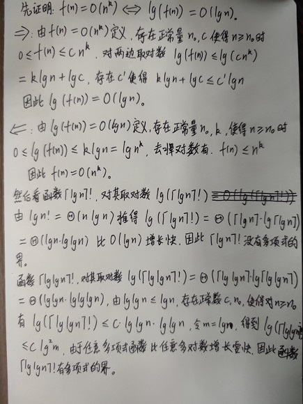
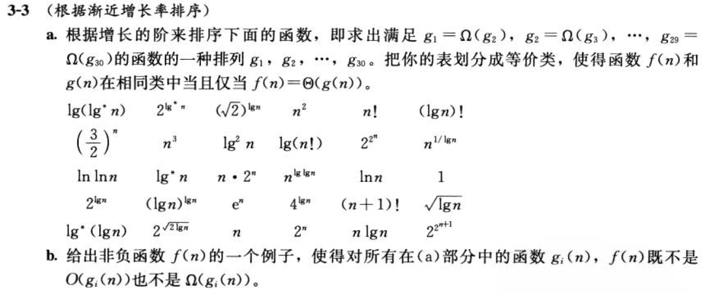
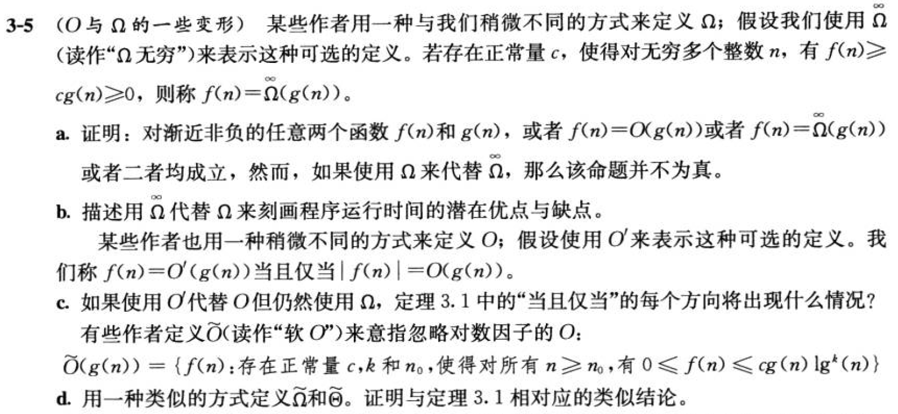
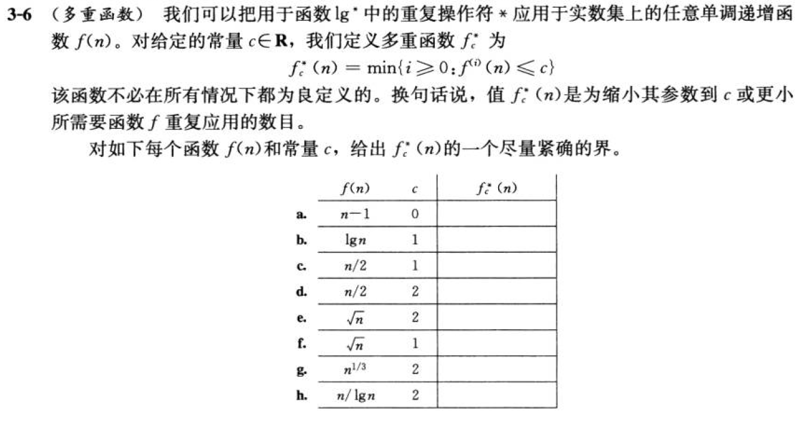

# 函数的增长

## 3.1-1

Q：假设$f(n)$与$g(n)$都是渐近非负函数。使用$\Theta$记号的基本定义来证明$max(f(n),g(n))=\Theta({f(n)+g(n)})$。

A：
证明存在正常量$c_1, c_2, n_0$，使得对所有$n\geq n_9$，有：
$$c_1f(n)+c_1g(n)\leq {max(f(n)+g(n))}\leq{c_2f(n)+c_2g(n)}$$
取$c_1$为1/4，$c_2$为2，且对于任意大的$n$，$f(n)$与$g(n)$都是渐近非负的，不论$max(f(n),g(n)) = f(n)/g(n)$取哪个，渐近符号定义的不等式都成立。

------------------------------------

## 3.1-2

Q：证明：对任意实常量$a$和$b$，其中$b>0$，有
$$(n+a)^b=\Theta{(n^b)} \tag{3.2}$$

A：

令$(n+a)\leq{2n}， 当|a|\leq n， (n+a) \geq {n/2}， 当|a|\leq {n/2}$

则有$n \geq{2a}$时，不等式$0 \leq {n/2} \leq {n+a} \leq {2n}$成立

对不等式乘幂b，得到$0 \leq {(n/2)^b} \leq {(n+a)^b} \leq{(2n)^b}$

则$c_1 = (1/2)^b, c_2 = 2^b, n_0 = 2a$时，得证。

------------------------------------

## 3.1-3

Q：解释为什么“算法A的运行时间至少是$\Omicron(n^2)$”这一表述是无意义的。

A：大O标记含义是指一个函数的上界，对于其包含函数，都要小于这个上界函数。当说运行时间至少是大O标记的函数时，相当于说运行时间的下界是其包含函数，即小于大O标记函数的任意函数，下界可以是一个任意小的函数时下界就没有意义了。

------------------------------------

## 3.1-4

Q：$2^{n+1}=\Omicron(2^n)$成立吗？$2^{2n}=\Omicron(2^n)$成立吗？

A：前一个成立（$c_1=3，使2^{n+1}\leq{3\cdot{2^n}}$），后一个不成立。

------------------------------------

## 3.1-5

Q：证明定理3.1。

A：

由$\omicron$定义可知，$0\leq{f(n)}\lt {cg(n)}$，对任意$c\gt 0$成立。
$$\lim\limits_{n \to \infty}{\frac{f(n)}{g(n)}} \lt{\lim\limits_{n \to \infty}{\frac{cg(n)}{g(n)}}} = c $$
因此$\lim\limits_{n \to \infty}{\frac{f(n)}{g(n)}} = 0$成立。

------------------------------------

## 3.1-6

Q：证明：一个算法的运行时间为$\Theta(g(n))$当且仅当其最坏情况运行时间为$\Omicron(g(n))$，且其最好情况运行时间为$\Omega(g(n))$。

A：

算法运行时间为$\Theta(g(n))$，证：最坏情况运行时间为$\Omicron(g(n))$，且最好情况运行时间为$\Omega(g(n))$。

设$f(n)$为算法的运行时间函数，则有：
$$0\leq{c_1g(n)}\leq{f(n)}\leq{c_2g(n)}$$
最好情况运行时间为$c_1g(n)$，最坏情况运行时间为$c_2g(n)$。当$c\geq{c_2},c_2g(n)\leq{cg(n)}=\Omicron(g(n))$，最坏情况运行时间为$\Omicron(g(n))$，同理最好情况运行时间为$Ω(g(n))$

最坏情况运行时间为$\Omicron(g(n))$，且最好情况运行时间为$\Omega(g(n))$，证：算法运行时间为$\Theta(g(n))$。

设最好情况运行时间为$f_1(n)\leq{c_1g(n)}$，最坏情况运行时间为$f_2(n)\geq{c_2g(n)}$。有$c_2g(n)\leq{f_2(n)}\leq{f(n)}\leq{f_1(n)}\leq{c_1g(n)}$，则$f(n)=\Theta(g(n))$。

------------------------------------

## 3.1-7

Q：证明：$\omicron(g(n))\cap{\omega(g(n))}$为空集。

A：设函数集$f_1(n)=\omicron(g(n))\lt{cg(n)}$，对任意$c\gt0$成立，函数集$f_2(n)=\omega(g(n))\gt{cg(n)}$，对任意$c\gt0$成立。由此对任意$c\gt0$，$f_1(n)\lt{cg(n)}\lt{f_2(n)}$，由此函数集$f_1(n)$与$f_2(n)$没有交集。

------------------------------------

## 3.1-8

Q：

A：

$$\Omega(g(n,m))=\{f(n,m):存在正常量c,n_0和m_0，使得对所有n\geq{n_0}或m\geq{m_0}，有{f(n,m)}\geq{cg(n,m)}\geq{0}\}$$

$$\Theta(g(n,m))=\{f(n,m):存在正常量c_1,c_2,n_0和m_0，使得对所有n\geq{n_0}或m\geq{m_0}，有0\leq{c_1g(n,m)\leq{f(n,m)\leq{c_2g(n,m)}}}\}$$

------------------------------------

## 3.2-1

Q：证明：若$f(n)$和$g(n)$是单调递增函数，则函数$f(n)+g(n)$和$f(g(n))$也是单调递增的，此外，若$f(n)$和$g(n)$是非负的，则$f(n)\cdot{g(n)}$是单调递增的。

A：

由$f(n)$和$g(n)$单调递增可得，对于$m_0\leq{m_1}$，有$f(m_0)\leq{f(m_1)},g(m_0)\leq{g(m_1)}$，对两不等式相加得$f(m_0)+g(m_0)\leq{f(m_1)+g(m_1)}$，所以$f(n)+g(n)$单调递增；对$f(m_0)\leq{f(m_1)}$，有$g(f(m_0))\leq{g(f(m_1))}$，所以$f(g(n))$单调递增。若$f(n)$和$g(n)$非负，有$f(n)\cdot{g(n)}\geq0$，因此$0\leq{f(m_0)g(m_0)}\leq{f(m_1)g(m_1)}$，$f(n)\cdot{g(n)}$是单调递增的。

------------------------------------

## 3.2-2

Q：证明等式(3.16)。

A：$$\Huge{a^{\log_b{c}}=a^{\frac{\log_a{c}}{\log_a{b}}}=(a^{\log_a{c}})^{(1/\log_a{b})}=c^{(1/\log_a{b})}=c^{\log_b{a}}}$$

------------------------------------

## 3.2-3

Q：证明等式(3.19)。并证明$n!=\omega(2^n)$且$n!=\omicron(n^n)$。

A：

$$\Huge\lim_{n\to\infty}\frac{\lg{n!}}{n\lg{n}}={\lim_{n\to\infty}\frac{1}{n}\frac{\lg{1}+\lg{2}+...+\lg{n}}{\lg{n}}}\leq{1}$$

$$\Huge\lim_{n\to\infty}\frac{\lg{n!}}{n\lg{n}}={\lim_{n\to\infty}\frac{(\lg{1}+\lg{n})+(\lg{2}+\lg{(n-1)})+...}{n\lg{n}}}\geq{{\lim_{n\to\infty}\frac{n/2\lg{n}}{n\lg{n}}}}={\frac{1}{2}}$$

证明$n!=\omega(2^n)$：

存在$n_0=4$，使得对$n\gt{n_0}$，有$n!=\underbrace{1\cdot{2}\cdot{3}\cdot{4}\cdot...\cdot{n}}_{\text{n}}>\underbrace{2\cdot{2}\cdot{2}\cdot{2}\cdot...\cdot{2}}_{\text{n}}$，因此$n!=\omega(2^n)$。

证明$n!=\omicron(n^n)$：

存在$n_0=1$，使得对$n\gt{n_0}$，有$n!=\underbrace{1\cdot{2}\cdot...\cdot{n}}_{\text{n}}\lt{\underbrace{n\cdot{n}\cdot...\cdot{n}}_{\text{n}}}$，因此$n!=\omicron(n^n)$。

------------------------------------

## 3.2-4

Q：函数$\lceil{\lg{n}}\rceil!$多项式有界吗？函数$\lfloor{\lg{\lg{n}}}\rfloor!$多项式有界吗？

A：

[参考页面](https://blog.csdn.net/yangtzhou/article/details/89098309)

------------------------------------

## 3.2-5

Q：如下两个函数中，哪一个渐近更大些：$\lg(\lg^*{n})$还是$\lg^*{(\lg{n})}$？

A：

$$\LARGE{\lim_{n\to{\infty}}\frac{\lg(\lg^*{n})}{\lg^*{(\lg{n})}}\overset{令t=\lg{n}}{=}\lim_{t\to{\infty}}\frac{\lg(\lg^*{2^t})}{\lg^*{t}}=\lim_{t\to{\infty}}\frac{\lg(\lg^*{t}+1)}{\lg{2^{\lg^*{t}}}}=\lim_{t\to{\infty}}\log_{2^{\lg^*{t}}}{(\lg^*{t}+1)}}\overset{令u=\lg^*{t}}{=}\lim_{u\to{\infty}}{\log_{2^u}{(u+1)}}=0$$

因此$\lg^*{(\lg{n})}$渐近更大。

------------------------------------

## 3.2-6

Q：证明：黄金分割率$\phi$及其共轭数$\hat{\phi}$都满足方程$x^2=x+1$。

A：根据黄金分割率的代数定义$a+b/a=a/b=\phi(a>b>0)$，推得$1+1/\phi=\phi$，即$\phi^2=\phi+1$，将$\hat{\phi}$带入方程$x^2=x+1$可推得$\hat{\phi} = 1/\phi$。即黄金分割率$\phi$及其共轭数$\hat{\phi}$都满足方程$x^2=x+1$。

------------------------------------

## 3.2-7

Q：用归纳法证明：第$i$个斐波那契数满足等式
$$F_i=\frac{\phi^i-\hat{\phi}^i}{\sqrt{5}}$$
其中$\phi$是黄金分割率且$\hat{\phi}$是其共轭数。

A：初始时，$F_0=0$，设$\Large{F_{n-1}=\frac{\phi^{(n-1)}-\hat{\phi}^{(n-1)}}{\sqrt{5}}}$成立，需证明$\Large{F_{n}=\frac{\phi^{(n)}-\hat{\phi}^{(n)}}{\sqrt{5}}}$成立。

根据斐波那契数性质，有
$$\Large{F_n=F_{n-2}+F_{n-1}=\frac{\phi^{(n-2)}-\hat{\phi}^{(n-2)}}{\sqrt{5}}+ \frac{\phi^{(n-1)}-\hat{\phi}^{(n-1)}}{\sqrt{5}}=\frac{\phi^{(n-2)}(1+\phi)-\hat{\phi}^{(n-2)}(1+\hat{\phi})}{\sqrt{5}}}$$

根据黄金分割率$\phi$及其共轭数$\hat{\phi}$都满足方程$x^2=x+1$(3.2-6)，有

$$\Large{\frac{\phi^{(n-2)}(1+\phi)-\hat{\phi}^{(n-2)}(1+\hat{\phi})}{\sqrt{5}}=\frac{\phi^{(n)}-\hat{\phi}^{(n)}}{\sqrt{5}}}$$

因此$\Large{F_{n}=\frac{\phi^{(n)}-\hat{\phi}^{(n)}}{\sqrt{5}}}$成立。

------------------------------------

## 3.2-8

Q：证明：$k\ln{k}=\Theta(n)$蕴涵着$k=\Theta(n/\ln{n})$

A：由$\Theta$的性质，$n=\Theta(k\ln{k})$，对两边取自然对数得$\ln(n)=\Theta(\ln{(k\ln{k}))}$(参考3.2-4解答)。

推得$\ln{n}=\Theta(\ln{k}+\ln{\ln{k}})=\Theta(\ln{k})(\ln{k}=\omega(\ln\ln{k}))$。

因此$\frac{n}{\ln{n}}=\frac{\Theta(k\ln{k})}{\Theta(\ln{k})}=\Theta(k)$

------------------------------------

## 思考题3-1

Q：

A：要证明$p(n)=\Omicron(n^k),k\geq{d}$。即存在正常量$c,n_0$，使得：
$$\sum_{i=0}^{d}{a_in^i}\leq{cn^d},n\geq{n_0}$$
$$a_0+a_1n+a_2n^2+...+a_dn^d\leq{cn^d}$$
$$c=a_d+b\geq{a_d+\frac{a_{d-1}}{n}+\frac{a_{d-2}}{n^2}+...+\frac{a_0}{n^d}}$$
$$b\geq{\frac{a_{d-1}}{n}+\frac{a_{d-2}}{n^2}+...+\frac{a_0}{n^d}}$$
当$b=1$时，存在$n_0=max(da_{d-1},d\sqrt{a_{d-2}},d\sqrt[3]{a_{d-3}},...,d\sqrt[d]{a_0})$。因此有$c,n_0$使得$p(n)\leq{cn^d},n\geq{n_0}$。
$b=-1$时可证明$p(n)=\Omega({n^k})$，其他同理。

------------------------------------

## 思考题3-2

Q：（相对渐近增长）为下表中的每对表达式$(A, B)$指出$A$是否是$B$的$\Omicron、\omicron、\Omega、\omega或\Theta$。假设$k\geq{1}、\epsilon\gt{0}、c\gt{1}$均为常量。回答应该以表格的形式，将“是”或“否”写在每个空格中。

A：

| A            | B             | $\Omicron$ | $\omicron$ | $\Omega$ | $\omega$ | $\Theta$ |
| ------------ | ------------- | ---------- | ---------- | -------- | -------- | -------- |
| $\lg^k{n}$   | $n^k$         | 是         | 是         | 否       | 否       | 否       |
| $n^k$        | $c^n$         | 是         | 是         | 否       | 否       | 否       |
| $\sqrt{n}$   | $n^{\sin{n}}$ | 否         | 否         | 否       | 否       | 否       |
| $2^n$        | $2^{n/2}$     | 否         | 否         | 是       | 是       | 否       |
| $n^{\lg{c}}$ | $c^{\lg{n}}$  | 是         | 否         | 是       | 否       | 是       |
| $\lg(n!)$    | $\lg(n^n)$    | 是         | 否         | 是       | 否       | 是       |

------------------------------------

## 思考题3-3

Q：

A：

a. 
$$2^{{2}^{n+1}}$$
$$2^{2^{n}}$$
$$(n+1)!$$
$$n!$$
$n!$性质$n!=\omicron(n^n),n!=\omega{(2^n)}$
$$e^n$$
$$n\cdot{2^n}$$
$$2^n$$
$$(3/2)^n$$
$$(\lg{n})^{\lg{n}}=n^{\lg{\lg{n}}}$$
$$(\lg{n})!$$
$$n^3$$
$$n^2=4^{\lg{n}}$$
$$n\lg{n}=\lg{n!}$$
$$n=2^{\lg{n}}$$
$$\sqrt{2}^{\lg{n}}$$
$$2^{\sqrt{2\lg{n}}}$$
（任意正的多项式函数都比任意多对数函数增长得快）
$$\lg^{2}n$$
$$\ln{n}$$
$$\sqrt{\lg{n}}$$
$$\ln{\ln{n}}$$
$$2^{\lg^{*}{n}}$$
$$\lg^{*}{n}=\lg^{*}{\lg{n}}$$
$$\lg(\lg^{*}{n})$$
$$n^{1/\lg{n}}(=2)和1$$

b. 

$$f(n)=\begin{cases} 
2^{2^{n}} &\text{if n mod 2 = 0}\\
0 &\text{if n mod 2 = 1}
\end{cases}$$

------------------------------------

## 思考题3-4

Q：（渐近记号的性质）假设$f(n)$和$g(n)$为渐近正函数。证明或反驳下面的每个猜测。

A：

a. $f(n)=\Omicron(g(n))$蕴涵$g(n)=\Omicron(f(n))$。

设$f(n)=n,g(n)=n^3$，显然$n^3=\Omicron(n)$不成立，因此不成立。

b. $f(n)+g(n)=\Theta(min(f(n), g(n)))$。

设$f(n)=n,g(n)=n^3,f(n)+g(n)=n^3+n=\Theta(n^3)\neq\Theta(min(f(n),g(n))$，因此不成立。

c. $f(n)=\Omicron(g(n))$蕴涵$\lg(f(n))=\Omicron(\lg(g(n)))$，其中对所有足够大的$n$，有$\lg(g(n))\geq1$且$f(n)\geq1$。

(3.2-4)已证。

d. $f(n)=\Omicron(g(n))$蕴涵$2^{f(n)}=\Omicron(2^{g(n)})$

设$2n=\Omicron(n),2^{2n}=4^{n}\neq{\Omicron(2^n)}$，因此不成立。

e. $f(n)=\Omicron((f(n))^2)$。

设$f(n)=1/2n\neq{\Omicron(1/4n^2)}$，因此不成立。

f. $f(n)=\Omicron(g(n))$蕴涵$g(n)=\Omega(f(n))$。

对于$f(n)\leq{c_0g(n)}$，$c_1=1/c_0$，使得$g(n)\geq{c_1g(n)}$。

g. $f(n)=\Theta(f(n/2))$。

设$n=2^n,c_1\sqrt{2}^n\leq{2^n\leq{c_2\sqrt{2}^n}}$，不等式不成立。

h. $f(n)+\omicron(f(n))=\Theta(f(n))$。

令$g(n)=\omicron(f(n))$，有$0\leq{g(n)}\lt{cf(n)}$对任意$c$成立，上式$c_0f(n)\leq{f(n)+g(n)}\leq{c_1f(n)}$，取$c_0=1,c_1=2$即满足$f(n)+o(f(n))=\Theta(f(n))$。

------------------------------------

## 思考题3-5

Q：

------------------------------------

## 思考题3-6

Q：

------------------------------------
