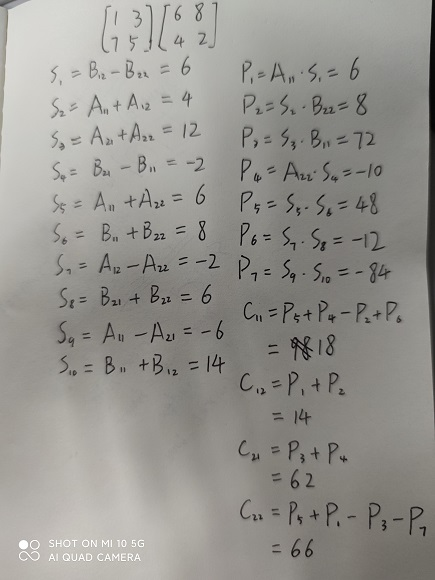
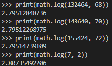

# 分治策略

## 4.1-1

Q：当A的所有元素均为负数时，FIND-MAXIMUM-SUBARRAY返回什么？

A：返回数组中最大的负数。

--------------------------------------

## 4.1-2

Q：对最大子数组问题，编写暴力求解方法的伪代码，其运行时间应该为$\Theta(n^2)$。

A：

```code
FIND-MAXIMUM-SUBARRAY-BRUTE(A, low, high):
    max = -INF
    left = low
    right = high
    for i = low to high
        sum = 0
        for j = i to high
            sum = sum + A[j]
            if sum > max
                max = sum
                left = i
                right = j
    return (left, right, max)
```

--------------------------------------

## 4.1-3

Q：在你的计算机上实现最大子数组问题的暴力算法和递归算法。请指出多大的问题规模$n_0$是性能交叉点————从此之后递归算法将击败暴力算法？然后，修改递归算法的基本情况————当问题规模小于$n_0$时采用暴力算法。修改后，性能交叉点会改变吗？

A：$n_0$在28，修改后性能交叉点变大为30。参考程序[A1_3.py](Resources/A1_3.py)。

--------------------------------------

## 4.1-4

Q：假定修改最大子数组问题的定义，允许结果为空子数组，其和为0。你应该如何修改现有算法，使它们能允许空子数组为最终结果？

A：当返回总值为负数时，返回空子数组（例如用 low > high 表示空子数组）。

--------------------------------------

## 4.1-5

Q：使用如下思想为最大子数组问题设计一个非递归的、线性时间的算法。从数组的左边界开始，由左至右处理，记录到目前为止已经处理过的最大子数组。若已知$A[1..j]$的最大子数组，基于如下性质将解扩展为$A[1..j+1]$的最大子数组：$A[1..j+1]$的最大子数组要么是$A[1..j]$的最大子数组，要么是某个子数组$A[i..j+1](1\leq{i}\leq{j+1})$。在已知$A[1..j]$的最大子数组的情况下，可以在线性时间内找出形如$A[i..j+1]$的最大子数组。

A：

```
FIND-MAXIMUM-SUBARRAY-LINEAR(A):
    n = A.length
    max_sum = -INF
    sum = -INF
    for j = 1 to n
        if sum > 0
            sum = sum + A[j]
        else
            current_low = j
            sum = A[j]
        if sum > max_sum
            max_sum = sum
            low = current_low
            high = j
    return (low, high, max_sum)
```

--------------------------------------

## 4.2-1

Q：使用Strassen算法计算如下矩阵乘法：
$$\begin{bmatrix}1 & 3 \\ 7 & 5\end{bmatrix}\begin{bmatrix}6 & 8 \\ 4 & 2\end{bmatrix}$$
给出计算过程。

A：


--------------------------------------

## 4.2-2

Q：为Strassen算法编写伪代码。

A：

```
SQUARE-MATRIX-MULTIPLY-STRASSEN(A, B):
    n = A.rows
    if n == 1
        return A_11 * B_11
    else 
        let C be a new n*n matrix
        partition A, B to 4 sub square matrix with n/2*n/2 elements
        S_1 = B_12 - B_22
        S_2 = A_11 + A_12
        S_3 = A_21 + A_22
        S_4 = B_21 - B_11
        S_5 = A_11 + A_22
        S_6 = B_11 + B_22
        S_7 = A_12 - A_22
        S_8 = B_21 + B_22
        S_9 = A_11 - A_21
        S_10 = B_11 + B_12
        P_1 = SQUARE-MATRIX-MULTIPLY-STRASSEN(A_11 , S_1)
        P_2 = SQUARE-MATRIX-MULTIPLY-STRASSEN(S_2 , B_22)
        P_3 = SQUARE-MATRIX-MULTIPLY-STRASSEN(S_3 , B_11)
        P_4 = SQUARE-MATRIX-MULTIPLY-STRASSEN(A_22 , S_4)
        P_5 = SQUARE-MATRIX-MULTIPLY-STRASSEN(S_5 , S_6)
        P_6 = SQUARE-MATRIX-MULTIPLY-STRASSEN(S_7 , S_8)
        P_7 = SQUARE-MATRIX-MULTIPLY-STRASSEN(S_9 , S_10)
        C_11 = P_5 + P_4 - P_2 + P_6
        C_12 = P_1 + P_2
        C_21 = P_3 + P_4
        C_22 = P_5 + P_1 - P_3 - P_7
        return C
```

--------------------------------------

## 4.2-3

Q：如何修改Strassen算法，使之适应矩阵规模$n$不是2的幂的情况？证明：算法的运行时间为$\Theta(n^{\lg7})$

A：对于矩阵规模不是2的幂的情况，扩充矩阵的行和列至一个大于$n$的2的幂，扩充的值均为0。通过Strassen算法计算该扩充矩阵，从左上角开始取一个大小为$n$的矩阵为结果。因为算法修改部分在开始和结束且花费$\Theta(n^2)$的处理时间，因此算法的运行时间为Strassen算法运行时间$\Theta(n^{\lg7})$。


--------------------------------------

## 4.2-4

Q：如果可以用$k$次乘法操作（假定乘法的交换律不成立）完成两个3 $\times$ 3矩阵相乘，那么你可以在$\omicron(n^{\lg7})$时间内完成n $\times$ n矩阵相乘，满足这一条件的最大的$k$是多少？此算法的运行时间是怎样的？

A：$\log_3{k}\lt{\log_2{7}}$，推得$k\lt{7^{\lg3}}\approx{22}$，因此满足这一条件的最大的$k=21$。此算法的运行时间为$\Theta(n^{\log_3{21}})$。

--------------------------------------

## 4.2-5

Q：V.Pan发现一种方法，可以用132464次乘法操作完成68 $\times$ 68的矩阵相乘，发现另一种方法，可以用143640次乘法操作完成 70 $\times$ 70 的矩阵相乘，还发现一种方法，可以用155424次乘法操作完成 72 $\times$ 72 的矩阵相乘。当用于矩阵相乘的分治算法时，上述哪种方法会得到最佳的渐近运行时间？与Strassen算法相比，性能如何？

A：




--------------------------------------

## 4.2-6

Q：用Strassen算法作为子进程来进行一个$kn \times n$矩阵和一个$n \times kn$矩阵相乘，最快需要花费多长时间？对两个输入矩阵规模互换的情况，回答相同的问题。

A：$n^{k\lg7}$和$kn^{\lg7}$。

--------------------------------------

## 4.2-7

Q：设计算法，仅使用三次实数乘法即可完成复数$a+bi$和$c+di$相乘。算法需接收$a、b、c和d$为输入，分别生成实部$ac-bd$和虚部$ad+bc$。

A：分别计算$(a + b)d, (c + d)a, (a - b)c$；有$(ac - bd) = (c + d)a - (a + b)d$，且$(ad + bc) = (c + d)a - (a - b)c$。

--------------------------------------

## 4.3-1

Q：证明：$T(n)=T(n-1)+n$的解为$\Omicron(n^2)$。

A：

$T(n)=T(n-1)+n$

$T(n-1)=T(n-2)+n-1$

$...$

$T(2)=T(1)+2$

将以上式子累加得$T(n)=T(1)+2+...+n$，令$T(1)=c$，$T(n)=1/2n^2+1/2n+c-1=\Omicron(n^2)$

--------------------------------------

## 4.3-2

Q：证明：$T(n)=T(\lceil{n/2}\rceil) + 1$的解为$\Omicron(\lg{n})$。

A：

$T(n) \le c\lg{\lceil{n/2}\rceil} + 1$

$\le c\lg(\frac{n}{2} + 1) + 1$

$=c\lg(\frac{n}{2}\frac{n+2}{n}) + 1$

$=c\lg{n} - c + c\lg{\frac{n+2}{n}} + 1$

$\le c\lg{n} - c + c\lg{\frac{5}{3}} + 1 (n\ge3)$

$\le c\lg{n} (c \ge (1-\lg{\frac{5}{3}})^{-1})$

--------------------------------------

## 4.3-3

Q：我们看到$T(n)=2T(\lfloor{n/2}\rfloor)+n$的解为$\Omicron(n\lg{n})$。证明$\Omega(n\lg{n})$也是这个递归式的解。从而得出结论：解为$\Theta(n\lg{n})$。

A：

假设$T(n)\geq c(n+2)\lg{(n+2)}$，则

$T(n)\geq 2c(\lfloor{n/2}\rfloor+2)\lg(\lfloor{n/2}\rfloor + 2)+n$

$\geq 2c(n/2 - 1 + 2)\lg(n/2-1+2) + n$

$= 2c \frac{n+2}{2}\lg{\frac{n+2}{2}} + n$

$=c(n+2)\lg(n+2)-c(n+2)\lg2+n$

$=c(n+2)\lg(n+2)+(1-c)n-2c$

$\geq c(n+2)\lg(n+2)$，当$n\geq {\frac{2c}{1-c}},0\leq{c}\lt1$成立

--------------------------------------

## 4.3-4

Q：证明：通过做出不同的归纳假设，我们不必调整归纳证明中的边界条件，即可克服递归式(4.19)中边界条件$T(1)=1$带来的困难。

A：

假设$T(n)\leq cn\lg{n} + n$，则

$T(n)\leq 2(c\lfloor{n/2}\rfloor\lg{\lfloor{n/2\rfloor+\lfloor{n/2}\rfloor})+n}$

$\leq 2c(n/2)\lg(n/2)+2(n/2)+n$

$= cn\lg(n/2)+2n$

$= cn\lg n - cn + 2n$

$\leq  cn\lg n + n$，当$c\geq 1$成立。此时边界条件$T(1)=1\leq cn\lg n + n = 0+1=1$也成立。

--------------------------------------

## 4.3-5

Q：证明：归并排序的“严格”递归式(4.3)的解为$\Theta(n\lg n)$

A：

证明(4.3)满足$T(n)\leq c(n-2)\lg(n-2)$

$T(n)\leq c(\lceil{n/2}\rceil-2)\lg(\lceil{n/2}\rceil-2)+c(\lfloor{n/2}\rfloor-2)\lg(\lfloor{n/2}\rfloor-2)+kn$

$\leq c(n/2+1-2)\lg(n/2+1-2)+c(n/2-1)\lg(n/2-1)+kn$

$= 2c(n/2-1)\lg(n/2-1)+kn$

$= c(n-2)\lg(n-2)+2c+(k-c)n$

$\leq c(n-2)\lg(n-2)$，当$c\gt k$时成立。有$T(n)=\Omicron(n\lg n)$。

证明(4.3)满足$T(n)\geq c(n+2)\lg(n+2)$

$T(n)\geq c(\lceil{n/2}\rceil+2)\lg(\lceil{n/2}\rceil+2)+c(\lfloor{n/2}\rfloor+2)\lg(\lfloor{n/2}\rfloor+2)+kn$

$\geq c(n/2-1+2)\lg(n/2-1+2)+c(n/2+1)\lg(n/2+1)+kn$

$=2c(n/2+1)\lg(n/2+1)+kn$

$=c(n+2)\lg(n+2)-2c+(k-c)n$

$\geq c(n+2)\lg(n+2)$，当$c\lt k$时成立。有$T(n)=\Omega(n\lg n)$。

因此(4.3)的解为$\Theta(n\lg n)$。

--------------------------------------

## 4.3-6

Q：证明：$T(n)=2T(\lfloor{n/2}\rfloor + 17)+n$的解为$\Omicron(n\lg n)$。

A：


