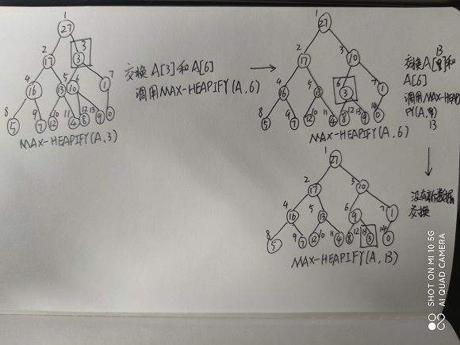
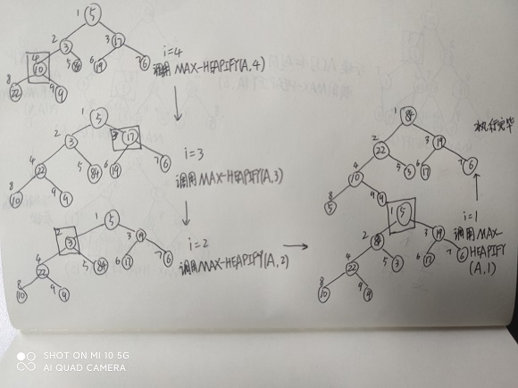
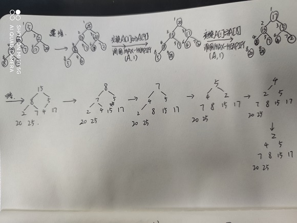
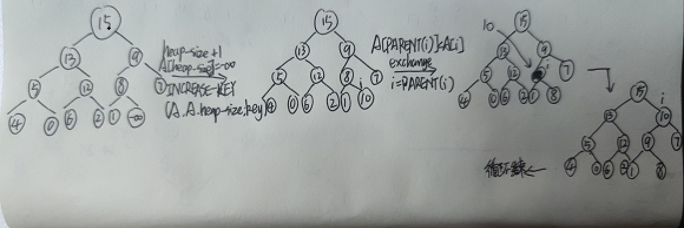
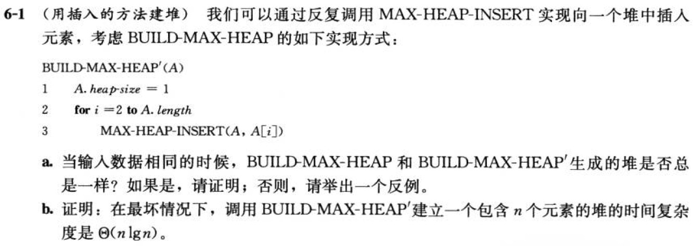
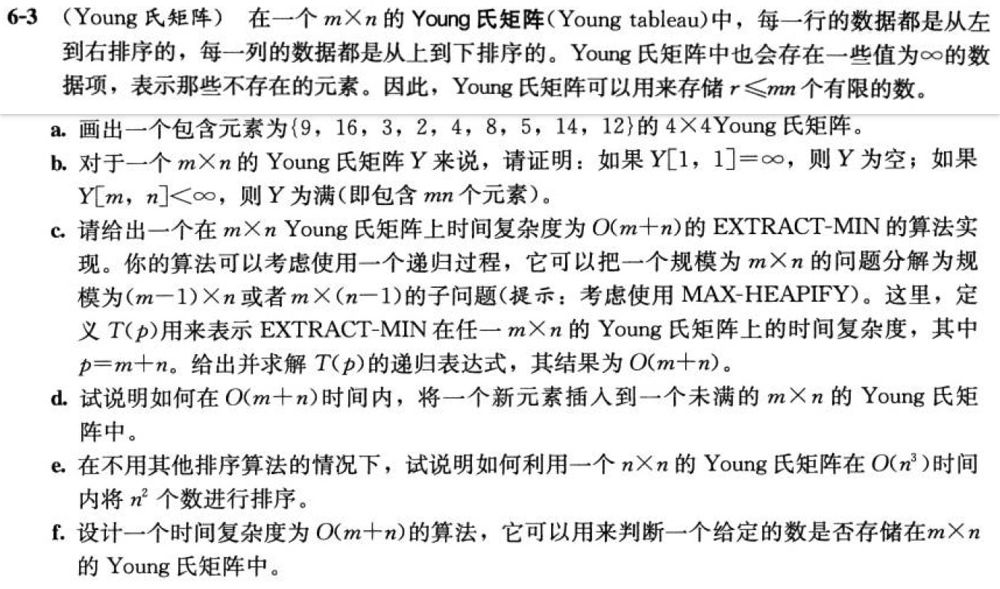

# 堆排序

## 6.1-1

Q：在高度为h的堆中，元素个数最多和最少分别是多少？

A：元素个数最多为$2^{h+1} - 1$，元素个数最少为$2^h$。

--------------------------------------

## 6.1-2

Q：证明：含$n$个元素的堆的高度为$\lfloor{\lg n}\rfloor$。

A：由(6.1-1)堆中元素个数最少为$2^h$，可得$2^h\leq n$，两边取对数得$h\leq \lg n$，因此含$n$个元素的堆的高度为$\lfloor{\lg n}\rfloor$。

--------------------------------------

## 6.1-3

Q：证明：在最大堆的任一子树中，该子树所包含的最大元素在该子树的根结点上。

A：假设某一最大堆的子树中，最大元素不在该子树的根结点上。那么对于该子树有$A[PARENT(max-element)]\leq A[max-element]$，与最大堆的性质矛盾，所以要么这个堆不是最大堆，要么最大元素在该子树的根结点上。从而可以推得，在最大堆的任一子树中，该子树所包含的最大元素在该子树的根结点上。

--------------------------------------


## 6.1-4

Q：假设一个最大堆的所有元素都不相同，那么该堆的最小元素应该位于哪里？

A：根据所有元素都不相同，和最大堆的性质可得，对于任意结点位置$i$，有$A[PARENT(i)]\gt A[i]$。设元素个数为$n$，最小元素位于位置$k$，满足$LEFT(k)>n$且$RIGHT(k)>n$，即某一叶结点上。

--------------------------------------


## 6.1-5

Q：一个已排好序的数组是一个最小堆吗？

A：是。其中任意位置$i$元素都满足最小堆的性质$A[PARENT(i)]\leq A[i]$。

--------------------------------------


## 6.1-6

Q：值为<23, 17, 14, 6, 13, 10, 1, 5, 7, 12>的数组是一个最大堆吗？

A：$A[4] \leq A[9]$，因此数组不是最大堆。

--------------------------------------

## 6.1-7

Q：证明：当用数组表示存储$n$个元素的堆时，叶结点下标分别是$\lfloor{n/2}\rfloor+1, \lfloor{n/2}\rfloor+2, ..., n$。

A：由于$LEFT(\lfloor{n/2}\rfloor+1)\geq (n+1)$，因此下标大于或等于$\lfloor{n/2}\rfloor+1$的结点没有子结点，即叶结点下标分别是$\lfloor{n/2}\rfloor+1, \lfloor{n/2}\rfloor+2, ..., n$。

--------------------------------------

## 6.2-1

Q：参照图6-2的方法，说明MAX-HEAPIFY(A, 3)在数组A=<27, 17, 3, 16, 13, 10, 1, 5, 7, 12, 4, 8, 9, 0>上的操作过程。

A：



--------------------------------------


## 6.2-2

Q：参考过程MAX-HEAPIFY，写出能够维护相应最小堆的$MIN-HEAPIFY(A, i)$的伪代码，并比较MIN-HEAPIFY与MAX-HEAPIFY的运行时间。

A：

```code
MIN-HEAPIFY(A, i)
    l = LEFT(i)
    r = RIGHT(i)
    if l <= A.heap-size and A[l] < A[i]
        smallest = l
    else
        smallest = i
    if i <= A.heap-size and A[r] < A[smallest]
        smallest = r
    if smallest != i
        exchange A[i] with A[smallest]
        MIN-HEAPIFY(A, smallest)
```

运行时间与MAX-HEAPIFY一致，为$\Omicron(\lg n)$。

--------------------------------------


## 6.2-3

Q：当元素$A[i]$比其他孩子的值都大时，调用$MAX-HEAPIFY(A, i)$会有什么结果？

A：不会产生递归调用，函数将不做任何事直接返回。

--------------------------------------


## 6.2-4

Q：当$i>\text{A.heap-size}/2$时，调用$MAX-HEAPIFY(A, i)$会有什么结果？

A：由于$LEFT(i)>\text{A.heap-size}$且$RIGHT(i)>\text{A.heap-size}$，因此函数将直接不做任何事直接返回。

--------------------------------------


## 6.2-5

Q：MAX-HEAPIFY的代码效率较高，但第10行中的递归调用可能例外，它可能使某些编译器产生低效的代码。请用循环控制结构取代递归，重写MAX-HEAPIFY代码。

A：

```code
MAX-HEAPIFY(A, i)
    while i <= A.heap-size
        l = LEFT(i)
        r = RIGHT(i)
        if A[i] < A[l]
            largest = l
        else
            largest = i
        if A[r] > A[largest]
            largest = r
        if largest == i
            break
        else
            exchange A[i] with A[largest]
            i = largest
```

--------------------------------------

## 6.2-6

Q：证明：对一个大小为$n$的堆，MAX-HEAPIFY的最坏情况运行时间为$\Omega(\lg n)$。（提示：对于$n$个结点的堆，可以通过对每个结点设定恰当的值，使得从根结点到叶结点路径上的每个结点都会递归调用MAX-HEAPIFY。）

A：一个大小为$n$的堆具有最大高度$\lg n$，考虑从根结点$i=1$开始一直递归到叶结点的MAX-HEAPIFY过程（对于一个最小堆）。此时遍历的结点总数最坏情况与最大高度一致为$\lg n$，因此最坏情况运行时间为$\Omega(\lg n)$。

--------------------------------------

## 6.3-1

Q：参照图6-3的方法，说明BUILD-MAX-HEAP在数组A=<5, 3, 17, 10, 84, 19, 6, 22, 9>上的操作过程。

A：




--------------------------------------

## 6.3-2

Q：对于BUILD-MAX-HEAP中第2行的循环控制变量i来说，为什么我们要求它是从$\lfloor{A.length/2}\rfloor$到1递减，而不是从1到$\lfloor{A.length/2}\rfloor$递增呢？

A：MAX-HEAPIFY过程要求根结点为$LEFT(i)$和$RIGHT(i)$都是最大堆。如果循环控制变量从1到$\lfloor{A.length/2}\rfloor$递增，则在调用MAX-HEAPIFY时，可能无法满足$LEFT(i)$和$RIGHT(i)$都是最大堆的先决条件。因此，无法通过MAX-HEAPIFY将以$i$为根结点的堆转化为最大堆。

--------------------------------------

## 6.3-3

Q：证明：对于任一包含$n$个元素的堆中，至多有$\lceil{n/2^{h+1}}\rceil$个高度为h的结点？

A：

用数学归纳法证明：

基本情况：高度为0时成立，至多有$\lceil{n/2}\rceil$，对于最底层满的堆自然成立，对于最底层不满$\lg n$的堆，不论缺偶数或奇数个才满，都能够推得条件成立。

假设，当$h=k$时，至多有$\lceil{n/2^{k+1}}\rceil$个高度为k的结点。证明当$h=k+1$时，至多有$\lceil{n/2^{k+2}}\rceil$个高度为k+1的结点。

因为堆的性质，结点每增高一层，结点数比较低层的最大结点数少一半，并且是满的。因此k+2层结点数是k+1层的最大结点数的一半，至多有$\lceil{n/2^{k+1}}\cdot 1/2\rceil$个高度为k+1的结点。


--------------------------------------

## 6.4-1

Q：参照图6-4的方法，说明HEAPSORT在数组A=<5, 13, 2, 25, 7, 17, 20, 8, 4>上的操作过程。

A：




--------------------------------------

## 6.4-2

Q：试分析在使用下列循环不变量时，HEAPSORT的正确性：

在算法的第2~5行for循环每次迭代开始时，子数组$A[1..i]$是一个包含了数组$A[1..n]$中第$i$小元素的最大堆，而子数组$A[i+1..n]$包含了数组$A[1..n]$中已排序的$n-i$个最大元素？

A：

初始化：对于最大堆A，$i=n$，$A[1..n]$是一个包含第$n$小元素（最大元素）的最大堆，子数组$A[n+1..n]$是空数组包含0个元素。

保持：对于一次迭代$i$，$A[1..i]$包含$A[1..n]$的第$i$小元素且为最大堆，因此第$i$小元素在$A[1]$位置，将其与$A[i]$交换，第$i$小元素交换后在$A[i]$位置。之后，将堆的大小减1，使$A[i]$不在堆的范围内，可知堆顶的左子树和右子树都满足最大堆的性质，调用$MAX-HEAPIFY(A, 1)$重新构造最大堆。此时子数组$A[1..i-1]$包含了$A[1..n]$的第$i-1$小元素且为最大堆，子数组$A[i..n]$包含了数组$A[1..n]$中剩余的$n-i$个元素，且第$i$小元素在$A[i]$位置（已排序）。令$i=i-1$，则满足循环不变量。

终止：终止时$i=1$，因此子数组$A[1]$包含了最小的元素，而子数组$A[2..n$包含了已排序的$n-1$个最大元素。


--------------------------------------

## 6.4-3

Q：对于一个按升序排列的包含$n$个元素的有序数组A来说，HEAPSORT的时间复杂度是多少？如果A是降序呢？

A：不论升序或降序，时间复杂度相同，都是$\Theta(n\lg n)$

--------------------------------------

## 6.4-4

Q：证明：在最坏情况下，HEAPSORT的时间复杂度是$\Omega(n\lg n)$

A：HEAPSORT的时间复杂度由两部分决定，建堆和$n$次$MAX-HEAPIFY(A, 1)$调用。对于建堆，在最坏情况下时间复杂度为$\Omicron(n)$(参考6.3节内容)。$n$次$MAX-HEAPIFY(A, 1)$调用最坏情况下时间复杂度$\Omega(n\lg n)$，因此HEAPSORT在最坏情况下时间复杂度是$\Omega(n\lg n)$。

--------------------------------------

## 6.4-5

Q：证明：在所有元素都不同的情况下，HEAPSORT的时间复杂度是$\Omega(n\lg n)$


--------------------------------------

## 6.5-1

Q：试说明HEAP-EXTRACT-MAX在堆A=<15, 13, 9, 5, 12, 8, 7, 4, 0, 6, 2, 1>上的操作过程。

A：


--------------------------------------

## 6.5-2

Q：试说明MAX-HEAP-INSERT(A, 10)在堆A=<15, 13, 9, 5, 12, 8, 7, 4, 0, 6, 2, 1>上的操作过程。

A：




--------------------------------------


## 6.5-3

Q：要求用最小堆实现最小优先队列，请写出HEAP-MINIMUM、HEAP-EXTRACT-MIN、HEAP-DECREASE-KEY和MIN-HEAP-INSERT的伪代码。

A：
```code
HEAP-MINIMUM(A)
    return A[1]
```
```code
HEAP-EXTRACT-MIN(A)
    if A.heap-size < 1
        error "heap underflow"
    min = A[1]
    A[1] = A[A.heap-size]
    A.heap-size = A.heap-size - 1
    MIN-HEAPIFY(A, 1)
    return min
```
```code
HEAP-DECREASE-KEY(A, i, key)
    if A[i] < key
        error "new key is larger than current key"
    A[i] = key
    while i > 1 and A[PARENT(i)] > A[i]
        exchange A[PARENT(i)] with A[i]
        i = PARENT(i)
```
```code
MIN-HEAP-INSERT(A, key)
    A.heap-size = A.heap-size + 1
    A[A.heap-size] = +INF
    HEAP-DECREASE-KEY(A, A.heap-size, key)
```

--------------------------------------


## 6.5-4

Q：在MAX-HEAP-INSERT的第2行，为什么我们要先把关键字设为$-\infty$，然后又将其增加到所需的值呢？

A：如果不设置为$-\infty$，由于该值是未初始化的，有可能会大于传入的key值，从而导致HEAP-INCREASE-KEY报错。

--------------------------------------

## 6.5-5

Q：试分析在使用下列循环不变量时，HEAP-INCREASE-KEY的正确性：

在算法的第4~6行while循环每次迭代开始的时候，子数组$A[1..A.heap-size]$要满足最大堆的性质。如果有违背，只有一个可能：$A[i]$大于$A[PARENT(i)]$。

这里，你可以假定在调用HEAP-INCREASE-KEY时，$A[1..A.heap-size]$是满足最大堆性质的。

A：

初始化：假定调用时满足最大堆性质，且$key\geq A[i]$，那么赋值后只存在两种情况，要么$A[i]>A[PARENT(i)]$，满足循环不变式的初始条件。要么$A[i]\leq A[PARENT(i)]$，函数直接返回。

保持：对于一次开始循环，$A[1..A.heap-size]$因$A[PARENT(i)]<A[i]$而不满足最大堆的性质，此时将$A[i]$与$A[PARENT(i)]$的值交换，使$A[PARENT(i)]>A[i]$，并使$i_0=PARENT(i)$。除去$i_0\leq 1$的情况外，存在两种情况，情况1：由于$A[PARENT(i_0)]>A[i]$(在未调用函数时，堆满足最大堆性质)，所以只有一个可能不满足最大堆性质即$A[i_0]>A[PARENT(i_0)]$，满足循环不变式。情况2：$A[i_0]<A[PARENT(i_0)]$满足最大堆性质，循环结束。

终止：没有任何违背最大堆性质的情况，则子数组$A[1..A.heap-size]$在插入后是一个最大堆。

--------------------------------------

## 6.5-6

Q：在HEAP-INCREASE-KEY的第5行的交换操作中，一般需要通过三次赋值来完成。想一想如何利用INSERTION-SORT内循环部分的思想，只用一次赋值就完成这一交换操作？

A：

```code
HEAP-INCREASE-KEY(A, i, key)
    if A[i] > key
        error "new key is smaller than current key"
    while i > 1 and A[PARENT(i)] < key
        A[i] = A[PARENT(i)]
        i = PARENT(i)
    A[i] = key
```

--------------------------------------


## 6.5-7

Q：试说明如何使用优先队列来实现一个先进先出队列，以及如何使用优先队列来实现栈。（队列和栈的定义见10.1节。）

A：

实现栈，以入队列的时间顺序为key，构造一个最小优先队列，入队用MIN-HEAP-INSERT，出队用HEAP-EXTRACT-MIN。

实现先进先出队列，以入队列的时间顺序为key，构造一个最大优先队列，入队用MAX-HEAP-INSERT，出队用HEAP-EXTRACT-MAX。

--------------------------------------


## 6.5-8

Q：HEAP-DELETE(A, i)操作能够将结点$i$从堆A中删除。对于一个包含$n$个元素的堆，请设计一个能够在$\Omicron(\lg n)$时间内完成的HEAP-DELETE操作。

A：

```code
HEAP-DELETE(A, i)
    if i > A.heap-size
        error "index out of range"
    exchange A[i] with A[A.heap-size]
    A.heap-size = A.heap-size - 1
    HEAPIFY(A, i)
```

--------------------------------------


## 6.5-9

Q：请设计一个时间复杂度为$\Omicron(n\lg k)$的算法，它能够将$k$个有序链表合并为一个有序链表，这里$n$是所有输入链表包含的总的元素个数。（提示：使用最小堆来完成$k$路归并。）

A：

步骤：

1. 以k个有序链表的首元素作为key，构造一个最小堆(BUILD-MIN-HEAP)。
2. 取走最小堆堆顶的元素，即归并链表的首元素，此时堆顶元素变为该链表的下一个元素，若没有下一个元素，则删除该结点。
3. 对堆顶调用MIN-HEAPIFY，维持最小堆性质。
4. 重复过程2，直到堆中没有任何结点为止。
5. 按取走顺序构成的链表即为归并结果链表，最终时间复杂度为调用$n$（所有输入链表包含的总的元素个数）次MIN-HEAPIFY（$\lg k$）的时间，即$\Omicron(n \lg k)$。

--------------------------------------

## 思考题6-1

Q：



A：

a.

不一样，例如对输入数据<1,2,3,4,5,6,7,8,9>，

$BUILD-MAX-HEAP$结果为<9,8,7,4,5,6,3,2,1>

$BUILD-MAX-HEAP'$结果为<9,8,6,7,3,2,5,1,4>

b.

上界易得；证明下界，HEAP-INCREASE-KEY在最坏情况下，即每次插入的值都大于根结点的值，得到HEAP-INCREASE-KEY的下界$\lg{n}$，MAX-HEAP-INSERT执行$n-1$次，可得$\Omega(n\lg{n})$。

综上时间复杂度为$\Theta(n\lg{n})$。

--------------------------------------

## 思考题6-2

Q：


A：

a.

```code
d-ARRAY-PARENT(i)
    return floor((i + d - 2) / d)

d-ARRAY-CHILD(i, c)
    return (i - 1) * d + 1 + c
```

b. 高度为$\Theta(\log_d{n})$。

c.

```code
d-ARRAY-MAX-HEAPIFY(A, i)
    largest = i
    for k = 1 to d
        if d-ARRAY-CHILD(i, k) <= A.heap-size and A[d-ARRAY-CHILD(i, k)] > A[largest]
            largest = d-ARRAY-CHILD(i, k)
    if largest != i
        exchange A[i] with A[largest]
        d-ARRAY-MAX-HEAPIFY(A, largest)
```

```code
d-ARRAY-EXTRACT-MAX(A)
    if A.heap-size < 1
        error "heap underflow"
    max = A[1]
    exchange A[1] with A[A.heap-size]
    A.heap-size = A.heap-size - 1
    d-ARRAY-MAX-HEAPIFY(A, 1)
    return max
```
每次d-ARRAY-MAX-HEAPIFY中for循环执行d次，从根结点到叶结点总计调用$\log_b{n}$次d-ARRAY-MAX-HEAPIFY过程，因此时间复杂度$\Omicron(d\log_d{n})$。

d. 
```code
INSERT(A, key)
    A.heap-size = A.heap-size + 1
    A[A.heap-size] = key
    i = A.heap-size
    while i > 1 and A[d-ARRAY-PARENT(i)] < A[i]
        exchange A[d-ARRAY-PARENT(i)] with A[i]
        i = d-ARRAY-PARENT(i)
```

时间复杂度为$\Omicron(\log_b n)$。

e.
```code
INCREASE-KEY(A, i, key)
    if k < A[i]
        error "new key is smaller than current key"
    while i > 1 and A[d-ARRAY-PARENT(i)] < key
        A[i] = A[d-ARRAY-PARENT(i)]
        i = d-ARRAY-PARENT(i)
    A[i] = key
```

时间复杂度为$\Omicron(\log_b n)$。

--------------------------------------

## 思考题6-3

Q：



A：

a.

|          |          |          |          |
| -------- | -------- | -------- | -------- |
| 2        | 3        | 4        | 5        |
| 8        | 9        | 12       | 14       |
| 16       | $\infty$ | $\infty$ | $\infty$ |
| $\infty$ | $\infty$ | $\infty$ | $\infty$ |

b. 

利用反证法，假设$Y[1,1] = \infty$时，Y中有不为$\infty$的值$d$。则该值所在的行A必有$Y[A, 1] \leq d$，此时$Y[A, 1] < Y[1, 1]$，不满足Young氏矩阵的性质。所以Y中没有不为$\infty$的值，因此Y为空。

同理可证，当$Y[m,n] < \infty$，Y为满。

c.

```code
EXTRACT-MIN(Y, m, n)
    if m < 1 or n < 1
        return INF
    min = Y[1, 1]
    v1 = EXTRACT-MIN(Y, m - 1, n)
    v2 = EXTRACT-MIN(Y, m, n - 1)
    if v1 < v2
        Y[1, 1] = v1
    else
        Y[1, 1] = v2
    return min
```

$T(p)=2T(p-1)+\Omicron(1)$，根据递归树得到解为$m+n-1$，因此结果为$\Omicron(m+n)$。

d. 过程同上。开始时调用在$Y[m, n]$位置，比较$Y[m - 1, n]$、$Y[m, n - 1]$与新元素的值，将三个值中最大的放到$Y[m, n]$位置。若新元素值最大，则调用结束。否则在$Y[m - 1, n]$、$Y[m, n - 1]$其中较大值的位置上，递归调用插入新元素的过程。

e. 调用d的过程，在Young氏矩阵中插入$n^2$个元素，总共消耗时间$n^2\cdot \Omicron(n + n)=\Omicron(n^3)$。再调用c的过程，每次调用消耗$\Omicron(n+n)=\Omicron(n)$，将$n^2$个元素从小到大取出，因此总的时间复杂度为$\Omicron(n^3)$。

f.

```code
FIND-YOUNG(A, m, n, v)
    if m < 1 or n < 1 or A[m, n] < v
        return NIL
    if A[m, n] == v
        return True
    p = FIND-YOUNG(A, m - 1, n, v)
    if p is NIL
        p = FIND-YOUNG(A, m, n - 1, v)
    if p is NIL
        return NIL
    return True
```

--------------------------------------
