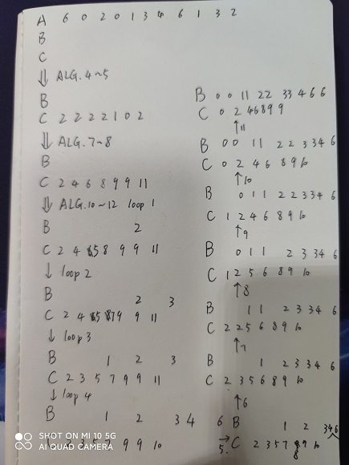
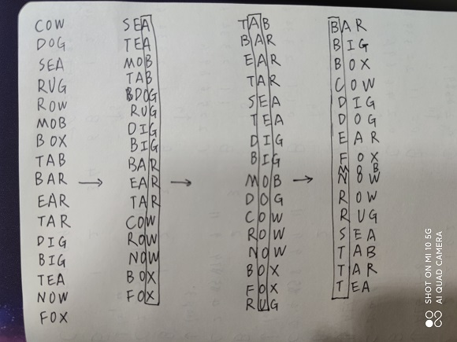

# 线性时间排序

## 8.1-1

Q：在一棵比较排序算法的决策树中，一个叶结点可能的最小深度是多少？

A：元素数量-1。

------------------------------

## 8.1-2

Q：不用斯特林近似公式，给出$\lg(n!)$的渐近紧确界。利用A.2节中介绍的技术来求累加和$\sum_{k=1}^{n} \lg k$。

A：

$\sum_{k=1}^n{\lg{k}} \leq \sum_{k=1}^n{\lg{n}} = n\lg{n} = \Omicron({n\lg{n}})$

$\sum_{k=1}^n{\lg{k}} \geq \lg{\sqrt{n}^n} = \frac{n}{2}\lg{n} = \Omega({n\lg{n}})$

因此$\sum_{k=1}^{n} \lg k = \Omicron(n\lg n)$。

------------------------------

## 8.1-3   

Q：证明：对$n!$种长度为$n$的输入中的至少一半，不存在能达到线性运行时间的比较排序算法。如果只要求对$1/n$的输入达到线性时间呢？$1/2^n$呢？

A：在一颗高为$h$、具有$l$个可达叶结点的决策树，满足下式：

$$n!\leq l \leq 2^h $$

由此$h\geq \lg n!=\Theta(n\lg n)$，

对于输入的一半有$h\geq \lg n!/2=\Theta(n\lg n)$，

对于输入的$1/n$有$h \geq \lg n!/n = \Theta(n\lg n)$，

对于输入的$1/2^n$有$h\geq \lg n!/2^n = \Theta(n\lg n)$，

因此对于以上的情况，都不存在能达到线性运行时间的比较排序算法。

------------------------------

## 8.1-4

Q：假设现有一个包含$n$个元素的待排序序列。该序列由$n/k$个子序列组成，每个子序列包含$k$个元素。一个给定子序列中的每个元素都小于其后继子序列中的所有元素，且大于其前驱子序列中的每个元素。因此，对于这个长度为$n$的序列的排序转化为对$n/k$个子序列中的$k$个元素的排序。试证明：这个排序问题中所需比较次数的下界是$\Omega(n\lg k)$。（提示：简单地将每个子序列的下界进行合并是不严谨的。）

A：每个子序列有$k!$种排列，对于$n/k$个子序列总共有$(k!)^{n/k}$种不同排列，由此可得$2^h \geq (k!)^{\frac{n}{k}}$，对两边取对数有：

$h \geq \lg{(k!)^{\frac{n}{k}}}$

$h \geq \frac{n}{k} k \lg{k}$

$h \geq n \lg{k} = \Omega(n \lg{k})$ 

------------------------------

## 8.2-1 

Q：参照图8-2的方法，说明COUNTING-SORT在数组$A=<6, 0, 2, 0, 1, 3, 4, 6, 1, 3, 2>$上的操作过程。

A：



------------------------------

## 8.2-2 

Q：试证明COUNTING-SORT是稳定的。

A：由算法的第10~12行，遍历下标的顺序是从大到小。设任意两个相同数字，在A中下标分别为number_1、number_2，有number_1 > number_2，可推得C[number_1] > C[number_2]，因此，排序后这两个相同数字保持相对位置不变。所以，COUNTING-SORT是稳定的。

------------------------------

## 8.2-3 

Q：假设我们在COUNTING-SORT的第10行循环的开始部分，将代码改写为：

```code
for j = 1 to A.length
```

试证明该算法仍然是正确的。它还稳定吗？

A：由于总数据未发生改变，且构造B的方式未改变，只是遍历A的方式发生改变。因此，对每类相同的数字number，其C[number]在B中所占的区间长度未发生改变。因此算法能保证每类number位于B中同样的下标段内，结果算法仍是正确排序的。但是，对于每类相同的number，假设有number_1、number_2作为其下标且number_1 < number_2，算法推得C[number_1] > C[number_2]，即A中最先出现的number，在B中是最后出现的，因此算法是不稳定的。

------------------------------

## 8.2-4

Q：设计一个算法，它能够对于任何给定的介于$0$到$k$之间的$n$个整数先进行预处理，然后在$\Omicron(1)$时间内回答输入的$n$个整数中有多少个落在区间$[a .. b]$内。你设计的算法的预处理时间应为$\Omega(n+k)$。

A：

```code
COUNTING-RANGE-COUNT(A, n, a, b)
    let C[0..k] be a new array    
    for i = 0 to k    
        C[i] = 0        
    for j = 1 to n    
        C[A[j]] = C[A[j]] + 1        
    for i = 1 to k    
        C[i] = C[i] + C[i - 1]
    return C[b] - C[a - 1]
```
------------------------------

## 8.3-1

Q：参照图8-3的方法，说明RADIX-SORT在下列英文单词上的操作过程：COW，DOG，SEA，RUG，ROW，MOB，BOX，TAB，BAR，EAR，TAR，DIG，BIG，TEA，NOW，FOX。

A：



------------------------------

## 8.3-2 

Q：下面的排序算法中哪些是稳定的：插入排序、归并排序、堆排序和快速排序？给出一个能使任何排序算法都稳定的方法。你所给出的方法带来的额外时间和空间开销是多少？

A：稳定排序：归并、插入。

可以把数据对应的原址下标数据记录下来。在对数据排序后，对值相同的数据，再按照原址下标排序一次。这种方法多出一倍的额外空间，时间多出一次插入排序的时间。

------------------------------

## 8.3-3 

Q：利用归纳法来证明基数排序是正确的。在你所给出的证明中，在哪里需要假设所用的底层排序算法是稳定的？

A：

对于基数排序数据只有1列的情况，自然是正确的；

假设基数排序对于数据为$n$列的情况，是正确的；

在此假设排序算法是稳定的，对第$n+1$列的排序，相同值不会改变其在源数据中的相对位置，且排序开始前，余下的$n$列是已排序的。可以推得，对第n+1列中任意两个相同的数，其余下的n列，相对位置是不变的，即已排序完成的顺序是不变的，因此余下的$n$列依然是有序的，且$n+1$列在排序完后也是有序的，即基数排序对于数据为$n+1$列可以得到有序的排列。根据归纳法，基数排序是正确的。

------------------------------

## 8.3-4 

Q：说明如何在$\Omicron(n)$时间内，对$0$到$n^3-1$区间内的$n$个整数进行排序。

A：将每个数看作n进制的数，对于区间$0$到$n^3-1$，每个数都有3位。因此，应用基数排序且有$d=3,k=n$，基数排序总时间为$\Theta(3(n+n))=\Theta(n)$。

------------------------------

## 8.3-5 

Q：在本节给出的第一个卡片排序算法中，为排序$d$位十进制数，在最坏情况下需要多少轮排序？在最坏情况下，操作员需要记录多少堆卡片？

A： 由于从高位到低位排序，最坏情况下对于每一列（位）的排序次数，都是上一列的排序次数的10倍，因此，总排序次数为$1+10+10^2+...+10^{d-1} = \frac{10^d-1}{9}$。操作员需要记录的卡片堆数为$9+9^2+...+9^{d-1}=\frac{9^{d-1}-1}{8}$。

------------------------------

## 8.4-1 

略

------------------------------

## 8.4-2 

退化为插入排序因此复杂度为$n^2$，可以将排序算法改为归并排序或快速排序

------------------------------

## 8.4-3 

$E[x^2] = \frac{1}{2} \times 1^2 + (1 - \frac{1}{2}) \times 0 ^ 2 = \frac{1}{2}$

$E^2[X] = (\frac{1}{2} \times 1 + (1 - \frac{1}{2}) \times 0) ^ 2 = \frac{1}{4}$

------------------------------

## 8.4-4

使每个圆环（园）的面积相同，则桶大小相同

------------------------------

## 8.4-5

共有n个数字，bucket的划分点$i_1$,$i_2$...$i_n$为P($i_1$) = $\frac{1}{n}$ , p($i_2$) = $\frac{2}{n}$, ..., P($i_n$) = $\frac{(n-1)}{n}$. 因为找出这些划分点需要n*O(1) = O(n)的时间，桶排序也是O(n)的，所以最终是O(n)的。