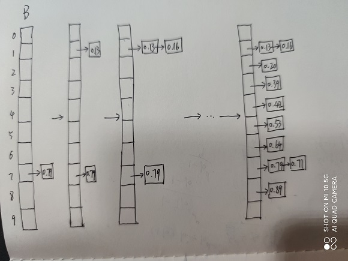
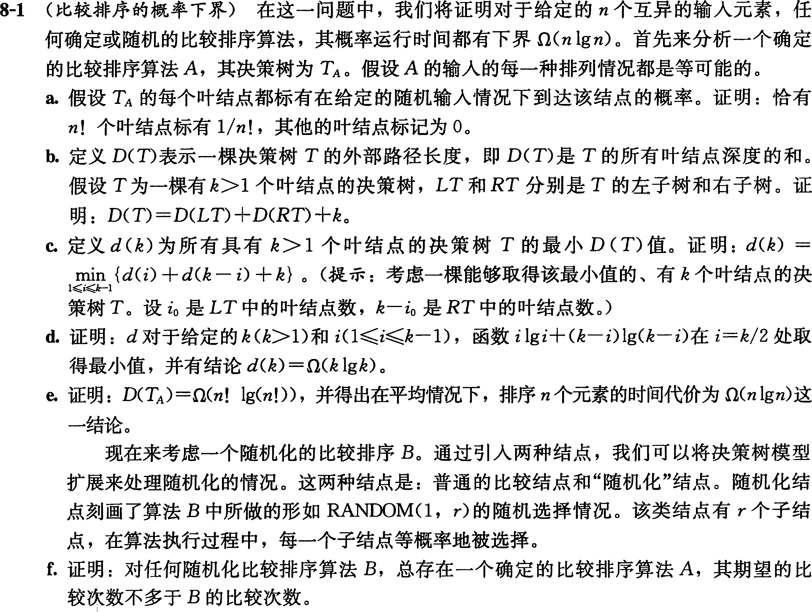
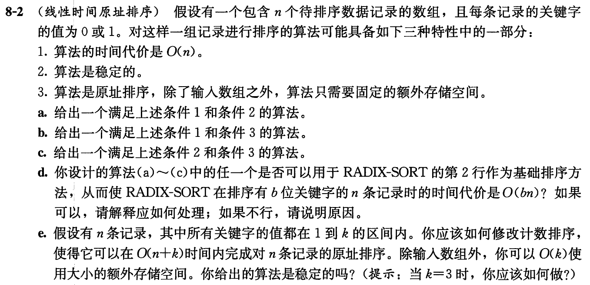
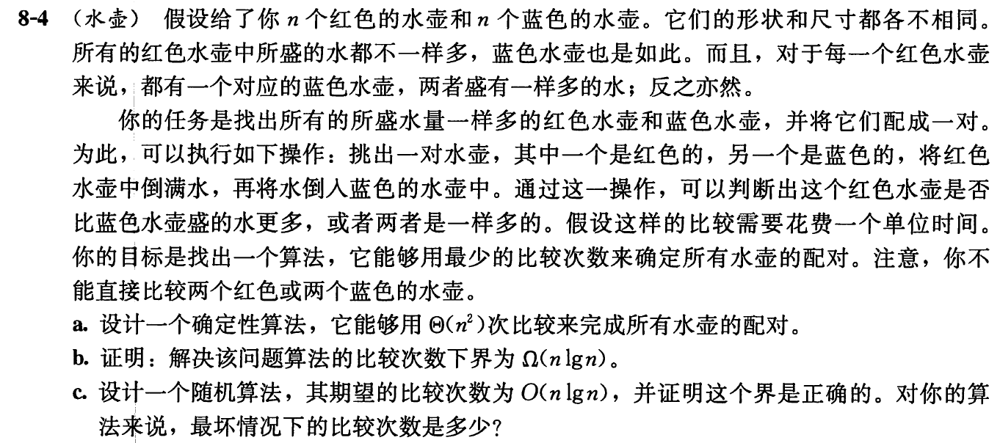
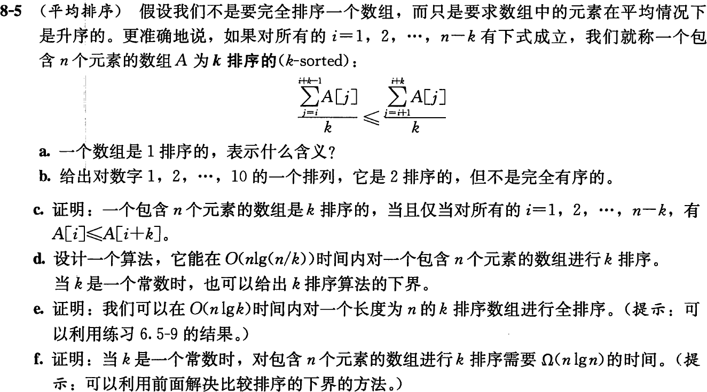
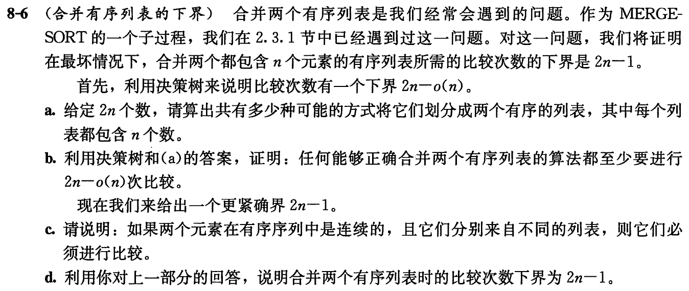
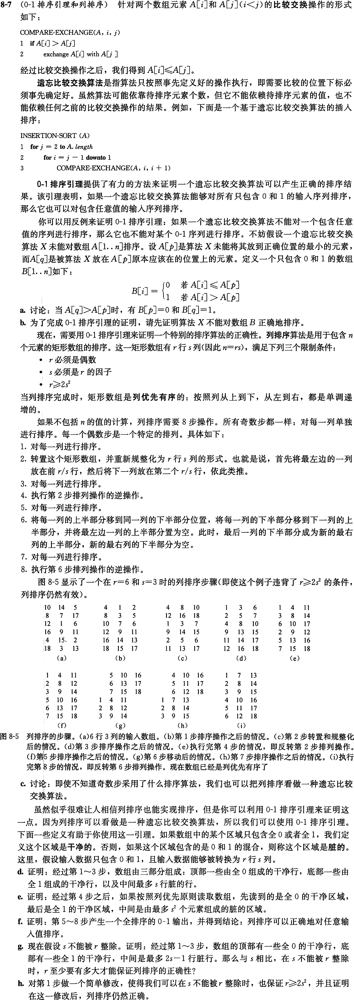

# 线性时间排序

## 8.1-1

Q：在一棵比较排序算法的决策树中，一个叶结点可能的最小深度是多少？

A：元素数量-1。

------------------------------

## 8.1-2

Q：不用斯特林近似公式，给出$\lg(n!)$的渐近紧确界。利用A.2节中介绍的技术来求累加和$\sum_{k=1}^{n} \lg k$。

A：

$\sum_{k=1}^n{\lg{k}} \leq \sum_{k=1}^n{\lg{n}} = n\lg{n} = \Omicron({n\lg{n}})$

$\sum_{k=1}^n{\lg{k}} \geq \lg{\sqrt{n}^n} = \frac{n}{2}\lg{n} = \Omega({n\lg{n}})$

因此$\sum_{k=1}^{n} \lg k = \Omicron(n\lg n)$。

------------------------------

## 8.1-3   

Q：证明：对$n!$种长度为$n$的输入中的至少一半，不存在能达到线性运行时间的比较排序算法。如果只要求对$1/n$的输入达到线性时间呢？$1/2^n$呢？

A：在一颗高为$h$、具有$l$个可达叶结点的决策树，满足下式：

$$n!\leq l \leq 2^h $$

由此$h\geq \lg n!=\Theta(n\lg n)$，

对于输入的一半有$h\geq \lg n!/2=\Theta(n\lg n)$，

对于输入的$1/n$有$h \geq \lg n!/n = \Theta(n\lg n)$，

对于输入的$1/2^n$有$h\geq \lg n!/2^n = \Theta(n\lg n)$，

因此对于以上的情况，都不存在能达到线性运行时间的比较排序算法。

------------------------------

## 8.1-4

Q：假设现有一个包含$n$个元素的待排序序列。该序列由$n/k$个子序列组成，每个子序列包含$k$个元素。一个给定子序列中的每个元素都小于其后继子序列中的所有元素，且大于其前驱子序列中的每个元素。因此，对于这个长度为$n$的序列的排序转化为对$n/k$个子序列中的$k$个元素的排序。试证明：这个排序问题中所需比较次数的下界是$\Omega(n\lg k)$。（提示：简单地将每个子序列的下界进行合并是不严谨的。）

A：每个子序列有$k!$种排列，对于$n/k$个子序列总共有$(k!)^{n/k}$种不同排列，由此可得$2^h \geq (k!)^{\frac{n}{k}}$，对两边取对数有：

$h \geq \lg{(k!)^{\frac{n}{k}}}$

$h \geq \frac{n}{k} k \lg{k}$

$h \geq n \lg{k} = \Omega(n \lg{k})$ 

------------------------------

## 8.2-1 

Q：参照图8-2的方法，说明COUNTING-SORT在数组$A=<6, 0, 2, 0, 1, 3, 4, 6, 1, 3, 2>$上的操作过程。

A：


------------------------------

## 8.2-2 

Q：试证明COUNTING-SORT是稳定的。

A：由算法的第10~12行，遍历下标的顺序是从大到小。设任意两个相同数字，在A中下标分别为number_1、number_2，有number_1 > number_2，可推得C[number_1] > C[number_2]，因此，排序后这两个相同数字保持相对位置不变。所以，COUNTING-SORT是稳定的。

------------------------------

## 8.2-3 

Q：假设我们在COUNTING-SORT的第10行循环的开始部分，将代码改写为：

```code
for j = 1 to A.length
```

试证明该算法仍然是正确的。它还稳定吗？

A：由于总数据未发生改变，且构造B的方式未改变，只是遍历A的方式发生改变。因此，对每类相同的数字number，其C[number]在B中所占的区间长度未发生改变。因此算法能保证每类number位于B中同样的下标段内，结果算法仍是正确排序的。但是，对于每类相同的number，假设有number_1、number_2作为其下标且number_1 < number_2，算法推得C[number_1] > C[number_2]，即A中最先出现的number，在B中是最后出现的，因此算法是不稳定的。

------------------------------

## 8.2-4

Q：设计一个算法，它能够对于任何给定的介于$0$到$k$之间的$n$个整数先进行预处理，然后在$\Omicron(1)$时间内回答输入的$n$个整数中有多少个落在区间$[a .. b]$内。你设计的算法的预处理时间应为$\Omega(n+k)$。

A：

```code
COUNTING-RANGE-COUNT(A, n, a, b)
    let C[0..k] be a new array    
    for i = 0 to k    
        C[i] = 0        
    for j = 1 to n    
        C[A[j]] = C[A[j]] + 1        
    for i = 1 to k    
        C[i] = C[i] + C[i - 1]
    return C[b] - C[a - 1]
```
------------------------------

## 8.3-1

Q：参照图8-3的方法，说明RADIX-SORT在下列英文单词上的操作过程：COW，DOG，SEA，RUG，ROW，MOB，BOX，TAB，BAR，EAR，TAR，DIG，BIG，TEA，NOW，FOX。

A：


------------------------------

## 8.3-2 

Q：下面的排序算法中哪些是稳定的：插入排序、归并排序、堆排序和快速排序？给出一个能使任何排序算法都稳定的方法。你所给出的方法带来的额外时间和空间开销是多少？

A：稳定排序：归并、插入。

可以把数据对应的原址下标数据记录下来。在对数据排序后，对值相同的数据，再按照原址下标排序一次。这种方法多出一倍的额外空间，时间多出一次插入排序的时间。

------------------------------

## 8.3-3 

Q：利用归纳法来证明基数排序是正确的。在你所给出的证明中，在哪里需要假设所用的底层排序算法是稳定的？

A：

对于基数排序数据只有1列的情况，自然是正确的；

假设基数排序对于数据为$n$列的情况，是正确的；

在此假设排序算法是稳定的，对第$n+1$列的排序，相同值不会改变其在源数据中的相对位置，且排序开始前，余下的$n$列是已排序的。可以推得，对第n+1列中任意两个相同的数，其余下的n列，相对位置是不变的，即已排序完成的顺序是不变的，因此余下的$n$列依然是有序的，且$n+1$列在排序完后也是有序的，即基数排序对于数据为$n+1$列可以得到有序的排列。根据归纳法，基数排序是正确的。

------------------------------

## 8.3-4 

Q：说明如何在$\Omicron(n)$时间内，对$0$到$n^3-1$区间内的$n$个整数进行排序。

A：将每个数看作n进制的数，对于区间$0$到$n^3-1$，每个数都有3位。因此，应用基数排序且有$d=3,k=n$，基数排序总时间为$\Theta(3(n+n))=\Theta(n)$。

------------------------------

## 8.3-5 

Q：在本节给出的第一个卡片排序算法中，为排序$d$位十进制数，在最坏情况下需要多少轮排序？在最坏情况下，操作员需要记录多少堆卡片？

A： 由于从高位到低位排序，最坏情况下对于每一列（位）的排序次数，都是上一列的排序次数的10倍，因此，总排序次数为$1+10+10^2+...+10^{d-1} = \frac{10^d-1}{9}$。操作员需要记录的卡片堆数为$9+9^2+...+9^{d-1}=\frac{9^{d-1}-1}{8}$。

------------------------------

## 8.4-1 

Q：参照图8-4的方法，说明BUCKET-SORT在数组$A=<0.79, 0.13, 0.16, 0.64, 0.39, 0.20, 0.89, 0.53, 0.71, 0.42>$上的操作过程。

A：




------------------------------

## 8.4-2 

Q：解释为什么桶排序在最坏情况下运行时间是$\Theta(n^2)$？我们应该如何修改算法，使其在保持平均情况为线性时间代价的同时，最坏情况下时间代价为$\Omicron(n\lg n )$？

A：因为桶排序当处理元素在相同桶中时，使用插入排序，在最坏情况下所有元素都落在相同桶中，则桶排序退化为插入排序，因此最坏情况下运行时间是$\Theta(n^2)$。可以对相同桶的元素采用其他的排序方式，例如归并排序。

------------------------------

## 8.4-3 

Q：设$X$是一个随机变量，用于表示在将一枚硬币抛掷两次时，正面朝上的次数。$E[X^2]$是多少呢？$E^2[X]$是多少呢？

A：

$X=\begin{cases}0 & 1/4\\ 1 & 1/2 \\ 2 & 1/4 \end{cases}$

$E[X^2] = 1/4 * 0^2 + 1/2 * 1^2 + 1/4 * 2^2 = 3/2$

$E^2[X] = 1^2 = 1$

------------------------------

## 8.4-4

Q：在单位圆内给定$n$个点，$p_i=(x_i, y_i)$，对所有$i=1, 2, ..., n$，有$0\lt x_i^2+y_i^2\leq 1$。假设所有的点服从均匀分布，即在单位圆的任一区域内找到给定点的概率与该区域的面积成正比。请设计一个在平均情况下有$\Theta(n)$时间代价的算法，它能够按照点到原点之间的距离$d_i=\sqrt{x_i^2+y_i^2}$对这$n$个点进行排序。（提示：在BUCKET-SORT中，设计适当的桶大小，用以反映各个点在单位圆中的均匀分布情况。）

A：

```code
BUCKET-SORT-CIRCLE(P)
    n = P.length
    let B[0 .. n - 1] be a new array
    for i = 0 to n - 1
        make B[i] an empty list
    for i = 1 to n
        val = P[i].x^2 + P[i].y^2
        insert P[i] into list B[floor(val)]
    for i = 0 to n - 1
        sort list B[i] with insertion sort by its val
    concatenate the lists B[0], B[1], ..., B[n - 1] together in order
```

------------------------------

## 8.4-5

Q：定义随机变量$X$的**概率分布函数**$P(x)$为$P(x)=Pr\{X\leq x\}$。假设有$n$个随机变量$X_1,X_2,...,X_n$服从一个连续概率分布函数$P$，且它可以在$\Omicron(1)$时间内被计算得到。设计一个算法，使其能够在平均情况下在线性时间内完成这些数的排序。

------------------------------

## 思考题8-1

Q：



A：

a. 对于一个正确的比较排序算法来说，$n$个元素的$n!$种可能的排列都应该出现在决策树的叶结点上，因此当给定一个随机输入的情况下，每种排列情况都是等可能的，那么每个可达的叶结点都标有$1/n!$，不可达的叶结点标记为$0$，且可达的叶结点的个数为$n!$。

b. 因为在决策树中，每个非叶结点都代表着一次比较，因此LT和RT要么是叶结点，要么就是一颗有左子树和右子树的根结点。此处有三种情况：情况1，LT和RT均为叶结点，结论自然成立；情况2，LT和RT中有一个为叶结点，对于另一边的子树(RT)而言，根结点的所有叶结点的深度和 D(T) - 子树所有叶结点的深度和 D(RT) = 1 + 子树叶结点个数 = 根结点的叶结点个数 (k)，且有D(LT) = 0。结论成立。情况3，LT和RT均为子树，D(LT)+D(RT)其叶结点深度的和在其根结点的基础上总共减少了（根结点的）叶结点个数，结论成立。

c. 设$i_0$是LT中的叶结点数，$k-i_0$是RT中的叶结点数，由b的结论，那么自然有$d(i_0)+d(k-i_0)+k$是决策树$T_0$的最小$D(T_0)$值。对于所有具有$k>1$个叶结点的决策树T，包含$T_0$在内，$i$的取值范围为$1\leq i \leq k -1$，则有对于T的最小D(T)值是$\underset{1\leq i \leq k -1}{min}\{d(i)+d(k-i)+k\}$。

d. 对函数$i\lg i + (k-i)\lg (k-i)$在$i$上求导：

$\lg i + i\cdot 1/i-\lg(k-i)+(k-i)\cdot -1/i$

$= \lg \frac{i}{k-i} + 2 - k / i$

当$i=k/2$时，上式值为0，即$i\lg i + (k-i)\lg (k-i)$在$i=k/2$时取得极小值为该式的最小值。

以下用代入法证明$d(k)\geq ck\lg k$

$d(k)\geq \underset{1\leq i \leq k -1}{min}\{ci\lg i + c(k-i)\lg (k-i)+k\}$

$= c(k\lg k/2)+k$

$= ck \lg k - (c-1)k$

$\geq ck \lg k$，当$c\geq 1$时成立。

e. 

------------------------------

## 思考题8-2

Q：



A：

a. 计数排序

b.

```code
i = 1
j = n
while i <= j
    if A[i] > A[j]
        exchange A[i] with A[j]
        i = i + 1
        j = j - 1
    elseif A[i] == 1
        j = j - 1
    else
        i = i + 1
```

c. 插入排序

d. (a)可以，对于有b位关键字的数据，对每一位应用计数排序确定这一位的排序位置，算法时间代价是$\Omicron(n)$且算法是稳定的。那么基数排序可以得到b位关键字数据的排序结果，且时间代价为$\Omicron(bn)$。

e. 

------------------------------

## 思考题8-3

Q：


A：

a. 先根据每个数的位长度，对数组进行桶排序，将相同位长度的数放在同一个桶中；然后对每个桶进行基数排序；最后按照已排序桶的顺序将结果串起来即可。

b. 根据每个字符串首字母的字典序，将字符串分别放在26个不同的桶中，并标记为1位；对已经放置在1位桶中的所有字符串，查看除标记位数以外的字符串首字母，如果有首字母则将其放置在26个不同的子桶中，并标记为2位，如果没有首字母则仍放置在原来的桶中。这样递归直到不产生子桶为止。从标记为1位的26个不同的桶中收集排序结果，先收集完每个桶的所有子桶后再收集下一个桶，即可得到排序结果。

------------------------------


## 思考题8-4

Q：



A：

a. 对于$n$个红色水壶中的一个任意的水壶，与每一个蓝色水壶花一个单位时间比较，总共需要$n$个单位时间能匹配到蓝色水壶。剩余$n-1$个红色水壶重复执行此操作。因此整个匹配过程完成需要时间为$(2+n)(n-1)/2=\Theta(n^2)$

b. 实质上该问题可以看作对于由n个大小不同的数组成的数列的比较排序问题，每次都将其中一个未排序的数与其他未排序数进行比较，以确定这个数在数列中的排序位置。由比较排序问题的下界可知，解决该问题算法比较次数下界为$\Omega(n\lg n)$。

c. 

------------------------------

## 思考题8-5

Q：



A：

a. 按非降序排序。

b. $<1, 3, 2, 4, 5, 7, 6, 8, 9, 10>$

c. 由包含$n$个元素的数组A为$k$排序的性质：

$\frac{\sum_{j = i}^{i + k - 1}{A[j]}}{k} \leq \frac{\sum_{j=i+1}^{i+k}{A[j]}}{k}$

$A[i] + A[i + 1] + A[i + 2] + ... + A[i+k-1] \leq A[i+1]+A[i+2]+...+A[i+k]$

$A[i] \leq A[i+k]$，对所有的$i=1, 2, ..., n-k$成立。该公式反推也成立，因此得证。

d. 将待排序的数组看作$k$个子数组，其中相同子数组内每个元素的下标mod$k$后值相同，每个子数组包含$n/k$个元素，对子数组进行时间复杂度在$\Omicron(n/k\lg (n/k))$的比较排序，因此总的时间复杂度为$\Omicron(n\lg (n/k))$。对子数组的比较排序完成后，再按照每个子数组最小元素的大小顺序排序子数组，得到$k$排序的结果数组。

e. 将已$k$排序好的数组看作$k$个有序数列，则问题转化为在$\Omicron(n\lg k)$时间内对$k$个有序数列进行归并。对这些序数列按首元素大小建最小堆，则该最小堆中总共有$k$个结点。每次从最小堆中取出堆顶元素值，并将该堆顶元素值赋值为对应数列的下一个元素。重建最小堆时间为$\Omicron(\lg k)$，重建最小堆的次数与元素总数量一致为$n$，因此通过该方法可以在$\Omicron(n\lg k)$时间内对一个长度为$n$的$k$排序数组进行全排序。

f. 

------------------------------

## 思考题8-6

Q：



A：

------------------------------

## 思考题8-7

Q：



A：

------------------------------
