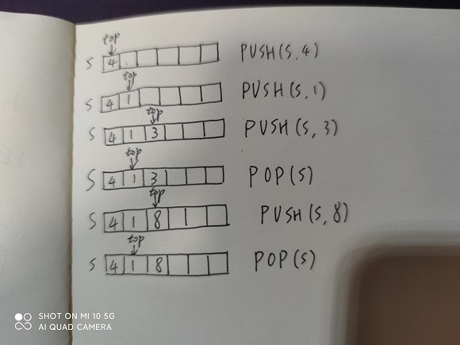
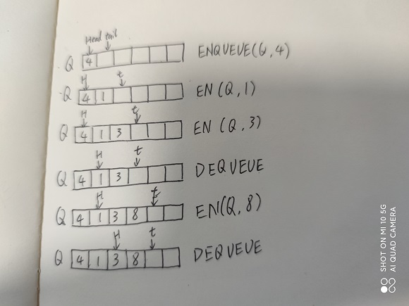

# 基本数据结构

## 10.1-1

Q：仿照图10-1，画图表示依次执行操作PUSH(S, 4)、PUSH(S, 1)、PUSH(S, 3)、POP(S)、PUSH(S, 8)和POP(S)每一步的结果，栈S初始为空，存储于数组S[1..6]中。

A：

---------------------------

## 10.1-2

Q：说明如何在一个数组A[1..n]中实现两个栈，使得当两个栈的元素个数之和不为$n$时，两者都不会发生上溢。要求PUSH和POP操作的运行时间为$\Omicron(1)$。

A：一个栈实现在数组的低位，top按栈元素个数递增，另一个栈实现在数组的高位，top按栈元素个数从$n$开始递减。

---------------------------

## 10.1-3

Q：仿照图10-2，画图表示依次执行操作ENQUEUE(Q, 4)、ENQUEUE(Q, 1)、ENQUEUE(Q, 3)、DEQUEUE(Q)、ENQUEUE(Q, 8)和DEQUEUE(Q)每一步的结果，队列初始为空，存储于数组Q[1..6]中。

A：

---------------------------

## 10.1-4

Q：重写ENQUEUE和DEQUEUE的代码，使之能处理队列的下溢和上溢。

A：

```code
ENQUEUE(Q, x)
    Q[Q.tail] = x
    if Q.tail == Q.length
        Q.tail = 1
    else Q.tail = Q.tail + 1
    if Q.tail == Q.head
        throw overflow
```

```code
DEQUEUE(Q)
    if Q.head == Q.tail
        throw underflow
    x = Q[Q.head]
    if Q.head == Q.length
        Q.head = 1
    else Q.head = Q.head + 1
    return x
```

---------------------------

## 10.1-5

Q：栈插入和删除元素只能在同一端进行，队列的插入操作和删除操作分别在两端进行，与它们不同的，有一种双端队列（deque），其插入和删除操作都可以在两端进行。写出4个时间均为$\Omicron(1)$的过程，分别实现在双端队列的两端插入和删除元素的操作，该队列是用一个数组实现的。

A：

```code
ENDEQUE_FRONT(Q, x)
    Q[Q.front] = x
    if Q.front == 1
        Q.front = Q.length
    else Q.front = Q.front - 1
    if Q.front == Q.end
        throw overflow
```

```code
DEDEQUE_FRONT(Q)
    if Q.front == Q.length
        Q.front = 1
    else Q.front = Q.front + 1
    if Q.front == Q.end
        throw underflow
    x = Q[Q.front]
    return x
```

```code
ENDEQUE_END(Q, x)
    Q[Q.end] = x
    if Q.end == Q.length
        Q.end = 1
    else Q.end = Q.end + 1
    if Q.front == Q.end
        throw overflow
```

```code
DEDEQUE_END(Q)
    if Q.end == 1
        Q.end = Q.length
    else Q.end = Q.end - 1
    if Q.front == Q.end
        throw underflow
    x = Q[Q.end]
    return x
```

---------------------------

## 10.1-6

Q：说明如何用两个栈实现一个队列，并分析相关队列操作的运行时间。

A：入队列操作为在栈1上PUSH；出队列操作需要进行条件判断，如果栈2为空，则依次将栈1中的元素POP并PUSH到栈2，并POP栈2顶端元素，否则直接POP栈2顶端元素。入队列操作时间为$\Omicron(1)$，出队列操作时间为$\Omicron(n)$或$\Omicron(1)$。

---------------------------

## 10.1-7

Q：说明如何用两个队列实现一个栈，并分析相关队列操作的运行时间。

A：将一个队列设为当前活动队列，入栈将元素ENQUEUE到当前活动队列；出栈时，将当前活动队列中的元素DEQUEUE并ENQUEUE到另一个队列中，直到当前活动队列中元素个数为1，将该元素视为出栈元素，并将当前活动队列设置为另一个队列。入栈时间为$\Omicron(1)$ ，出栈时间为$\Omicron(n)$。


---------------------------

## 10.2-1

Q：单链表上的动态集合操作INSERT能否在$\Omicron(1)$时间内实现？DELETE操作呢？

A：INSERT可以，DELETE不行。

---------------------------

## 10.2-2

在单链表的头部PUSH和POP即可

---------------------------

## 10.2-3

用两个指针分别代表head和tail，ENQUEUE时将head的next和head指向入队的元素，DEQUEUE时出队tail当前指向的元素并将tail指向tail的next

---------------------------

## 10.2-4

暂时令L.nil的key为k，在最后判断x和L.nil是否为同一个结点即可。

---------------------------

## 10.2-5

    INSERT(L, key):
    nex = L.nil.next
    pre = nex
    nex = nex.next
    while nex != L.nil
        if pre.key <= key and nex.key >= key
            new node.key = key
            pre.next = node
            node.next = nex
            return
        pre = nex
        nex = nex.next
    
    DELETE(L, key):
    f = L.nil
    pre = f
    f = f.next
    while f != L.nil and f.key <= key
        if f.key == key
            pre.next = f.next
            remove f from L
            return
        pre = f
        f = f.next

    SEARCH(L, key):
    f = L.nil.next
    while f != L.nil and f.key <= key
        if f.key == key
            return f
        f = f.next

时间复杂度都为:$\Omicron(n)$

---------------------------

## 10.2-6

链表，把两个链表的首尾链接起来构成一个链表包含$S_1$和$S_2$的所有元素。

---------------------------

## 10.2-7

用两个指针，把prev和next的指针反向链接起来，head指向最后一个元素即可。

---------------------------

## 10.3-2

与多数组表示法类似，不过是next从key下标位移+1的位置处拿到。

---------------------------

## 10.3-3

ALLOCATE-OBJECT不需要设置prev是将获取到的free结点插入到双向链表中时会按照插入位置初始化prev的值；FREE-OBJECT不需要重置prev是因为单链表没有使用prev中的值。

---------------------------

## 10.4-2

    RECURSIVE-TRAVERSE(root)
        if root != NIL
            print root
            RECURSIVE-TRAVERSE(root->left)
            RECURSIVE-TRAVERSE(root->right)

---------------------------

## 10.4-3

    NON-RECURSIVE-TRAVERSE(root)
        if root == NIL
            return
        stack.push(root)
        while stack not empty
            cur = stack.pop()
            print cur
            if cur->left != NIL
                stack.push(cur->left)
            if cur-right != NIL
                stack.push(cur->right)

---------------------------

## 10.4-4

与10.4-3过程一致，只是字段名有变化