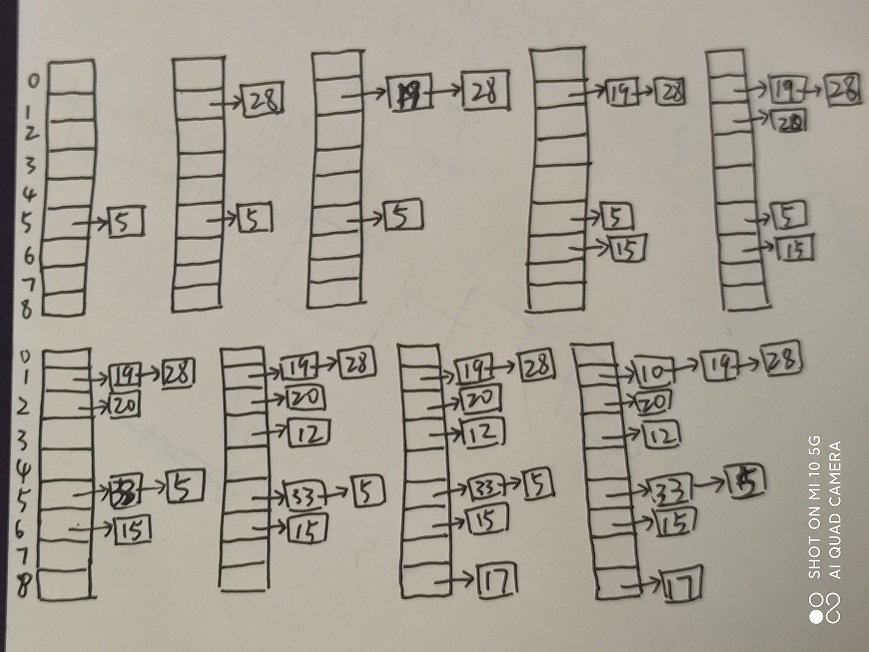

# 散列表

TODO:

11.2-5

11.2-6

11.3-3

11.3-5

11.3-6


## 11.1-1

Q：假设一动态集合S用一个长度为$m$的直接寻址表T来表示。请给出一个查找S中最大元素的过程。你所给的过程在最坏情况下运行时间是多少？

A：从下标0到$m-1$逐一查看元素存在与否，并比较元素与记录的最大元素。最坏情况下运行时间为$\Omicron(m)$。

---------------------------

## 11.1-2

Q：位向量是一个仅包含0和1的数组。长度为$m$的位向量所占空间要比包含$m$个指针的数组少得多。请说明如何用一个位向量来表示一个包含不同元素（无卫星数据）的动态集合。字典操作的运行时间应为$\Omicron(1)$。

A：假设动态集合的最大元素为$m$，则申请一个有$m$位的位向量，用1代表该位的位数所对应的元素在动态集合内，0代表不在集合内。

---------------------------

## 11.1-3

Q：试说明如何实现一个直接寻址表，表中各元素的关键字不必都不相同，且各元素可以有卫星数据。所有三种字典操作（INSERT、DELETE和SEARCH）的运行时间应为$\Omicron(1)$。（不要忘记DELETE要处理的是被删除对象的指针变量，而不是关键字。）

A：根据最大关键字$m$建立一个大小$m$的数组，数组中每个位置指向一个记录相同关键字元素指针的链表。

---------------------------

## 11.1-4


Q：


A：

---------------------------

## 11.2-1


Q：假设用一个散列函数$h$将$n$个不同的关键字散列到一个长度为$m$的数组T中。假设采用的是简单均匀散列，那么期望的冲突数是多少？更准确地，集合$\{\{k, l\}: k \neq l，且h(k)=h(l)\}$的期望值是多少？

A：该集合中元素个数为$\frac{n^2-n}{2}$，单个元素满足条件，即指示器随机变量$X_{ij}=I\{h(k_i)=h(k_j)\}$，在简单均匀散列的假设下，有$E[X_{ij}]=1/m$，因此集合的期望值为$\frac{n^2-n}{2m}$。

---------------------------


## 11.2-2

Q：对于一个用链接法解决冲突的散列表，说明将关键字5，28，19，15，20，33，12，17，10插入到该表中的过程。设该表中有9个槽位，并设其散列函数为$h(k)=k \% 9$。

A：

---------------------------


## 11.2-3

Q：Marley教授做了这样一个假设，即如果将链模式改动一下，使得每个链表都能保持已排好序的顺序，散列的性能就可以有较大的提高。Marley教授的改动对成功查找、不成功查找、插入和删除操作的运行时间有何影响？

A：对删除的运行时间没有影响；插入的运行时间变为的$\Omicron(1+\alpha)$，此处$\alpha$代表链表的平均期望长度；成功查找和不成功查找的运行时间相同均为$\Omicron(1+\alpha)$。

---------------------------


## 11.2-4

Q：说明在散列表内部，如何通过将所有未占用的槽位链接成一个自由链表，来分配和释放元素所占的存储空间。假定一个槽位可以存储一个标志、一个元素加上一个或两个指针。所有的字典和自由链表操作均应具有$\Omicron(1)$的期望运行时间。该自由链表需要是双向链表吗？或者，是不是单链表就足够了呢？

A：需要是双向链表，因为字典操作需要$\Omicron(1)$的期望运行时间，即对于自由链表中的任意一个结点都需要分配为新的散列表元素，需要将其从自由链表中断开，并且标志为散列表元素。

---------------------------

## 11.2-5

Q：假设将一个具有$n$个关键字的集合存储到一个大小为$m$的散列表中。试说明如果这些关键字均源于全域$U$，且$|U|>nm$，则$U$中还有一个大小为$n$的子集，其由散列到同一槽位中的所有关键字构成，使得链接法散列的査找时间最坏情况下为$\Theta(n)$。

A：

---------------------------


## 11.2-6

Q：假设将$n$个关键字存储到一个大小为$m$且通过链接法解决冲突的散列表中，同时已知每条链的长度，包括其中最长链的长度$L$，请描述从散列表的所有关键字中均匀随机地选择某一元素并在$\Omicron(L\cdot({1+1/\alpha}))$的期望时间内返回该关键字的过程。

A：

---------------------------

## 11.3-1

Q：假设我们希望査找一个长度为$n$的链表，其中每一个元素都包含一个关键字$k$并具有散列值$h(k)$。每一个关键字都是长字符串。那么在表中査找具有给定关键字的元素时，如何利用各元素的散列值呢？

A：先对给定关键字执行散列函数$h(k)$得到其散列值，然后遍历链表比较各元素与给定散列值，可以减少比较字符串效率低带来的影响。

---------------------------

## 11.3-2

Q：假设将一个长度为$r$的字符串散列到$m$个槽中，并将其视为一个以128为基数的数，要求应用除法散列法。我们可以很容易地把数$m$表示为一个32位的机器字，但对长度为$r$的字符串，由于它被当做以128为基数的数来处理，就要占用若干个机器字。假设应用除法散列法来计算一个字符串的散列值，那么如何才能在除了该串本身占用的空间外，只利用常数个机器字？

A：对于长度为$r$的字符串，将其按基数散列处理后若长度还是超过指定的机器字长度，则在已处理的数据上再次按基数散列处理，直到占用空间在指定的机器字长度内为止。

---------------------------

## 11.3-3

Q：考虑除法散列法的另一种版本，其中$h(k)=k\mod m，m=2^p-1，k$为按基数$2^p$表示的字符串。试证明：如果串$x$可由串$y$通过其自身的字符置换排列导出，则$x$和$y$具有相同的散列值。给出一个应用的例子，其中这一特性在散列函数中是不希望出现的。

A：


---------------------------

## 11.3-4

Q：考虑一个大小为$m=1000$的散列表和一个对应的散列函数$h(k)=\lfloor{m(kA\mod1)}\rfloor$其中$A=(\sqrt{5}-1)/2$，试计算关键字61、62、63、64和65被映射到的位置。

A：

```python
import math

def f(k):
    return math.floor(1000 * math.fmod(k * (math.sqrt(5) - 1) / 2 , 1))
```

```text
f(61) = 700
f(62) = 318
f(63) = 936
f(64) = 554
f(65) = 172
```
---------------------------


## 11.3-5

Q：定义一个从有限集合$U$到有限集合$B$上的散列函数簇$\Eta$为$\epsilon$全域的，如果对$U$中所有的不同元素对$k$和$l$，都有
$$Pr\{h(k)=h(l)\}\leq \epsilon$$
其中概率是相对从函数簇$\Eta$中随机抽取的散列函数$h$而言的。试证明：一个$\epsilon$全域的散列函数簇必定满足：
$$\epsilon\geq{\frac{1}{|B|}-\frac{1}{|U|}}$$

A：

---------------------------

## 11.3-6

Q：设$U$为由取自$\Zeta_p$中的值构成的$n$元组集合，并设$B=\Zeta_p$，其中$p$为素数。对于一个取自$U$的输入$n$元组<$a_0, a_1, ..., a_{n-1}$>，定义其上的散列函数$h_b:U\to{B(b\in\Zeta_p)}$为：
$$h_b(<a_0, a_1, ..., a_{n-1}>)=(\sum^{n-1}_{j=0}{a_jb^j})\mod{p}$$
并且设$\Eta=\{h_b:b\in{\Zeta_p}\}$。根据练习11.3-5中$\epsilon$全域的定义，证明$\Eta$是$((n-1)/p)$全域的。（提示：见练习31.4-4。）


A：

---------------------------
